# Attendees, Contacts, And RSVP

Compass supports adding/removing guests on events you organize on a
**writable Google calendar**, an optional Google-contacts suggestion picker
for that guest field, and RSVP (accepted/declined/tentative) to events
you're invited to — per occurrence or for a whole series. Compass never
sends email itself; Google emails guests via `sendUpdates` when asked to.

Non-organizer guest-list editing (`guestsCanModify`) is out of scope for v1:
invited users get the RSVP control only, never the guest editor. Local
(non-Google) calendars reject attendee writes with a typed error.

## High-Level Flow

```mermaid
flowchart LR
  subgraph Web["packages/web"]
    AF[AttendeeField]
    RC[RsvpControl]
    SF[useSaveEventForm]
    EM[useEventMutations]
  end
  subgraph Backend["packages/backend"]
    EC[event.controller]
    ECT[event-command.translation]
    CC[contacts.controller]
  end
  subgraph Sync["packages/sync"]
    CMD["POST /internal/commands"]
    PCS[provider-command.service]
    GEW[google-event-writer.adapter]
    GPA[google-people.adapter]
  end
  Google[(Google Calendar / People API)]

  AF -->|guest chips| SF
  SF -->|invitation prompt if guests changed| EM
  RC -->|rsvp mutation| EM
  EM -->|PUT /api/event/:id, POST /api/event/:id/rsvp| EC
  EC --> ECT
  ECT -->|create/update/delete/rsvp command| CMD
  CMD --> PCS
  PCS -->|mergeAttendees against freshly fetched state| GEW
  GEW -->|insert/patch, sendUpdates| Google
  AF -.->|GET /api/contacts/suggestions| CC
  CC -.->|GET /internal/contacts/suggestions| GPA
  GPA -.-> Google
```

Sync owns every line of Google-specific code (writer adapter, people
adapter, scopes); the backend only translates browser JSON into sync
commands and proxies contacts reads. See
[Google Sync And SSE Flow](./google-sync-and-sse-flow.md) for the general
sync/SSE architecture this feature reuses (incoming RSVP changes from other
attendees, and Compass's own optimistic answer settling, both arrive back
over the same `eventsChanged` SSE signal).

## Editing The Guest List

Source: `packages/core/src/types/event-command.contracts.ts`
(`EditableContentSchema.attendees`),
`packages/web/src/views/Forms/EventForm/AttendeeField/AttendeeField.tsx`,
`packages/web/src/views/Forms/hooks/useSaveEventForm.ts`.

- The browser write input's `content.attendees` field is **tri-state by
  presence**: omitted means "not editing guests" (provider membership flows
  through untouched — today's default behavior, byte-identical to pre-
  attendee-support payloads); present (including `[]`) means "replace
  membership with exactly this set." Entries are `{email, displayName}` —
  no `responseStatus` ever rides the write side.
- The editor (`AttendeeField`) only renders for the organizer, on a writable
  Google calendar, on a single event or a series base — never on one
  occurrence of a series (guest edits have no per-occurrence semantics; see
  `packages/web/src/views/Forms/EventForm/EventForm.attendees.test.tsx`).
  A recurring series-base edit that changed the guest set narrows
  `RecurrenceScopeDialog` to "All Events" only
  (`RecurrenceScopeDialog.test.tsx`).
- Incoming RSVP from other attendees is visible to the host without
  photos: chips and the read-only guest list show a compact status badge
  (yes / no / maybe / awaiting) looked up from the live `Attendee[]` by
  email. The write path stays `{email, displayName}` — `responseStatus`
  never rides `AttendeeInput`. The guest summary uses the same observer
  labels (`1 guest (0 yes, 1 awaiting)`), distinct from the user's own
  Going / Maybe / Decline control. Jump to the guest field with `e` then
  `a`, or Mod+8 while the form is open (Mod+9 is notes; Account keeps
  Mod+5 with no letter). When the combobox is hidden (invitee / read-only
  / occurrence), the same shortcuts focus the read-only guest list.
- Typing an invalid string never creates a chip — `AttendeeField`'s
  `isValidAttendeeEmail` gate rejects it inline ("Enter a valid email
  address") and nothing reaches `onChange`
  (`e2e/attendees/attendee-editor.spec.ts` "an invalid email never becomes a
  chip"; unit-level in `AttendeeField.test.tsx`).
- A touched-but-unchanged guest list (add then remove) normalizes back to
  "not editing guests" before the save, so it round-trips byte-identically
  and never shows the invitation prompt
  (`useSaveEventForm.attendees.test.tsx`).

### Invitation-intent semantics (save-time prompt)

Source: `packages/core/src/types/event-command.contracts.ts`
(`InvitationIntentValueSchema`),
`packages/web/src/views/Forms/EventForm/SendInvitationsDialog.tsx`.

When (and only when) a save actually changed the guest set,
`useSaveEventForm` shows "Send invitation emails?" **before** submitting
anything. Send (the default, focused on open) maps to `invitation: "all"`;
"Don't send" maps to `"none"`; dismissing (Escape/backdrop/Cancel) aborts
the save entirely — the draft stays open, untouched. An unchanged guest
list sends no `attendees` key and no `invitation` key at all, so it is
wire-identical to a pre-attendee-support save
(`e2e/attendees/attendee-editor.spec.ts`, all three save scenarios assert
the exact wire body; `useSaveEventForm.attendees.test.tsx`).

`invitation` also threads through create and delete
(`event-command.translation.ts`); a delete's cancellation-email choice uses
the same three-value vocabulary. Google sends every email itself via
`sendUpdates` — Compass has no email infrastructure of its own.

### Merge-by-email (sync) and replay rules

Source: `packages/sync/src/domain/merge-update-content.ts` (`mergeAttendees`),
`packages/sync/src/domain/provider-command.service.ts`.

Sync commands carry `attendeesEdit: "replace" | "preserve"` (default
`"preserve"` — the backward-compat guarantee: every existing caller and
stored command stays valid). On `"replace"`, `mergeAttendees(intended,
providerCurrent)` merges the browser's *intended* email set against
**freshly fetched provider state** (never sync's own stored record — a
concurrent RSVP between syncs would otherwise be clobbered):

- an email present in both keeps the provider's current `responseStatus`
  and `displayName`;
- a new email enters as `needsAction`;
- a dropped email is removed.

Google's patch endpoint replaces the **whole** `attendees` array, so this
merge is the only thing standing between an edit and silently uninviting
everyone — `mergeAttendees` is pure and table-tested in isolation
(`merge-update-content.test.ts`, 9 cases + a purity assertion). A
`"preserve"` command never touches `attendees` in the write body at all —
proven byte-identical against the pre-attendee-support insert/patch shape
(`google-event-writer.adapter.test.ts` "omits the attendees key when the
write does not intend a guest edit").

**Replay**: sync's replay check (`matchesIntendedEdit`) always ignores
`responseStatus` drift (RSVP changes must never block replay of an
unrelated edit); with `attendeesEdit: "replace"` it additionally compares
by **email set only** — a resubmitted identical command is a no-op even if
some other attendee's RSVP changed in between
(`provider-command.service.db.test.ts`).

### The organizer guard, and the create-time backstop

A guest replacement requires the calendar's account to be the event's
organizer (or a Compass-created event with no organizer yet — treated as
organized). The guard fails typed and closed before any provider call.
On **create**, guests only ever deliver to a writable Google calendar; the
web belt-drops a guest edit targeting anything else
(`useSaveEventForm.ts`), and the backend/sync stack backstops the same
rule server-side with the typed `ATTENDEES_UNSUPPORTED` error (403,
non-retryable) — see
`packages/backend/src/event/event.error.ts` and
`event-command.translation.test.ts`.

## Contacts Suggestions (Optional Consent)

Source: `packages/core/src/types/contact.contracts.ts`,
`packages/sync/src/providers/google/google-people.adapter.ts`,
`packages/sync/src/server/contacts.routes.ts`,
`packages/backend/src/contacts/controllers/contacts.controller.ts`,
`packages/web/src/views/Forms/EventForm/AttendeeField/useContactSuggestions.ts`.

Contacts (`contacts.readonly` + `contacts.other.readonly`) are Google
*sensitive* scopes requested on the onboarding consent screen but **never
required** — a user who leaves them unchecked completes sign-in normally
(explicit tests on both backend and web pin this: "signs up successfully
when the optional contacts scopes are not granted" /
"completes sign-in when the optional contacts scopes are not granted";
`e2e/oauth/google-auth-callback.spec.ts` covers both the granted and
denied paths end-to-end). `GOOGLE_AUTH_SCOPES_REQUIRED` (web), the
backend's required-scope validation, sync's base `GOOGLE_SCOPES`, and the
e2e spec's own `REQUIRED_SCOPES` constant never include the contacts
scopes — every WP that touched this area added a literal-pinned test
asserting the list is unchanged.

Flow:

1. Per-connection `grantedScopes` (already the mechanism incremental
   Google auth uses) derive a `suggestContacts` capability
   (`google-capabilities.ts`), surfaced on `GoogleSyncConnectionSummary` /
   `selectCanSuggestContacts` in the web's `user-metadata.store.ts`.
2. `AttendeeField` gets a real `suggestionSource` only when the capability
   is true; otherwise it falls back to a plain email-chip input with no
   network calls (`emptySuggestionSource`), and a non-nagging
   "Enable contact suggestions" nudge can render in the listbox footer
   (`EnableContactSuggestionsNudge.tsx`, frequency rule pinned in
   `contact-nudge.gate.test.ts`: at most once per session, dismissal
   persisted forever).
3. Typing debounces 250ms (`CONTACT_SUGGESTION_DEBOUNCE_MS`) and requires
   ≥2 characters (`CONTACT_SUGGESTION_QUERY_MIN_LENGTH`) before querying
   `GET /api/contacts/suggestions?q=` → backend `contacts.controller.ts`
   → sync `GET /internal/contacts/suggestions` (principal-scoped) →
   `google-people.adapter.ts` → the People API, ranked and merged. Every
   layer degrades a failure to a typed empty result (backend: `[]` under a
   200, never a 4xx/5xx bubbled to the UI) so a sync outage never fires an
   error toast per keystroke. `e2e/attendees/contact-suggestions.spec.ts`
   exercises the full min-length + debounce + pick-a-suggestion path
   against a stubbed suggestions endpoint.
4. Privacy: neither the query string nor any suggestion/contact content is
   ever logged, on either the sync or backend side — both emit only static
   log lines built from content-free error facts
   (`kind`/`status`/`correlationId`); pinned literally in
   `contacts.controller.test.ts` and proven via the safety canary (below).

## RSVP Semantics

Source: `packages/core/src/types/event-command.contracts.ts`
(`RsvpEventInputSchema`),
`packages/sync/src/domain/provider-command.service.ts`
(`executeProviderRsvp`),
`packages/web/src/views/Forms/EventForm/RsvpControl.tsx`,
`packages/web/src/views/Forms/EventForm/RsvpScopeDialog.tsx`.

- `RsvpControl` renders a "Going? / Maybe / Decline" `radiogroup` whenever
  the connected account's email matches an attendee entry on the event
  (case-insensitive, organizer included) — on any calendar the account can
  read, including a viewer-access (reader) calendar, since answering an
  invitation is not a calendar write
  (`EventForm.rsvp.test.tsx`).
- **Self-entry rewrite, never a full replace.** The provider write rewrites
  only the caller's own attendee entry — `executeProviderRsvp` fetches the
  target's current provider state fresh, finds the self entry by the
  connection's account email, and patches back the *whole* list with just
  that one entry's `responseStatus` changed and `sendUpdates: "none"`
  (answering an invitation never emails anyone). There is deliberately no
  organizer guard — the organizer RSVPing to their own event is allowed,
  because Google lists the organizer as an attendee of their own event.
- **Per-occurrence vs. series.** The web posts to
  `POST /api/event/:id/rsvp`; a single event answers immediately with
  `scope: "single"` and no dialog. An **occurrence** of a series
  (`eventId::recurrenceId` composite id) opens
  `RsvpScopeDialog` — "This Event" / "All Events" **only**, defaulting to
  "This Event" — because an RSVP has no `thisAndFollowing` semantics; sync
  has no code path that can ever mint one
  (`e2e/attendees/rsvp.spec.ts` asserts exactly two dialog radios and
  no "following" text anywhere). A **series base** (no single occurrence to
  answer) skips the dialog entirely and always answers `scope: "all"` —
  offering a per-occurrence choice on a base id would be a lie. Server-side,
  `scope: "single"` on a composite id resolves through the writer's own
  `fetchInstanceAt` (never a hand-built instance id) and patches the
  resolved instance while the series master's stored guest list and
  version stay untouched; `scope: "all"` patches the master directly,
  never resolving an instance
  (`provider-command.service.db.test.ts` "instance-vs-master targeting").
- **Optimistic UI + settle.** The web repaints only the self entry
  immediately and rolls back on a `503`; the provider-confirmed list
  settles through the same SSE-backed invalidation path
  (`eventsChanged`) that carries in other attendees' RSVP changes
  (`useEventMutations.rsvp.test.tsx`).
- **Route contract.** `POST /api/event/:id/rsvp` answers `204 No Content`
  (the sync command outcome carries no event content); `responseStatus:
  "needsAction"` is rejected `400` at the route (you cannot RSVP back to
  unanswered). Idempotency key hashes event + status + scope (+ decoded
  recurrenceId) — replaying the same answer is a no-op; changing the
  answer, scope, or target mints a new key.
- A transiently-failed RSVP command is swept and retried like any other
  sync command (`"rsvp"` is in `RETRYABLE_KINDS`,
  `stale-command-retry.service.db.test.ts`).

## Named Warts (Accepted For v1)

These are deliberate, documented trade-offs — not bugs to silently fix
later without revisiting the product decision.

1. **Fetch→patch race.** Every attendee/RSVP write fetches current provider
   state, computes a merge, then patches unconditionally
   (`expectedVersion: null` for RSVP; no If-Match retry loop for either
   path). A provider-side change landing inside that fetch→patch window can
   be overwritten. This is intentional: RSVP drift in particular must never
   block a write, and etag/If-Match retry loops are explicitly out of scope
   for the whole pack.
2. **Alias-email self-match.** The RSVP self entry is matched by the
   connected account's own email, case-insensitively. A Google account
   alias that doesn't match the connection's stored email will not be
   recognized as "self," and `RsvpControl` will not render for that
   attendee entry.
3. **Organizer auto-added on create.** Google auto-adds the organizer as an
   `accepted` attendee when an event is created, so a post-create readback
   can differ from the exact set the client sent. The normalizer handles
   this on read; never compare a create request body to the readback and
   expect an exact match.
4. **Non-organizer guest editing (`guestsCanModify`) is unsupported.**
   Invited non-organizers get the RSVP control only. This is a documented
   v1 scope cut, not a wart, but is listed here because it is the single
   biggest gap between what Google Calendar itself allows and what Compass
   exposes.

## Safety

`packages/sync/src/safety/safety-canary.ts` forbids attendee/contact JSON
shapes in sync logs, SSE payloads, and error causes; this is asserted
end-to-end for guest-list writes, RSVP writes, and contact suggestion
failures across the sync and backend safety-canary suites (see the
Evidence sections of WP-02, WP-05, WP-07 in
`wip/attendee-support/` while that pack still exists, or the sync/backend
`*safety*` test files directly after it is deleted).

## E2E Coverage

`e2e/attendees/` (Playwright, chromium): `attendee-editor.spec.ts`,
`contact-suggestions.spec.ts`, `rsvp.spec.ts`, plus the shared
`attendee-harness.ts`. The harness runs the same anonymous local-mode e2e
web server as every other Playwright suite in this repo (there is no real
backend on port 3000), so it simulates a signed-in Google state exactly
like `e2e/oauth/` and `e2e/calendars/calendar-experience.spec.ts` do:
`__COMPASS_E2E_TEST__` engages the app's e2e seams, remembered auth
(`compass.auth` in `localStorage`) steers the event repository onto the
remote API, `window.__COMPASS_E2E_HOOKS__.setAuthenticated(true)` flips
`useCalendarsQuery`'s session gate (a **separate** gate from the
repository-source flag — both must be set, or the calendar list never
leaves the synthesized anonymous-local calendar and no fixture event ever
appears on the grid), and every `/api/**` call is stubbed with captured
request bodies for payload assertions. Buttons inside floating
`OverlayPanel` dialogs (the Send/Don't send prompt, the RSVP/recurrence
scope dialogs) are clicked via a DOM `element.click()` dispatch
(`dispatchClick`) rather than Playwright's built-in `.click()`, because
the panel's re-render between Playwright's actionability check and the
actual pointer dispatch otherwise swallows the click with no error and no
network call — the same class of issue already documented for the Save
button in `e2e/utils/event-test-utils.ts`.

This closes the coverage gap WP-08 flagged: its accessibility sweep runs
the same anonymous local-mode harness, where no Google invitation state
can exist, so `RsvpControl`/`AttendeeField` never mount there and are
axe-swept via RTL semantics instead (`RsvpControl.test.tsx`,
`AttendeeField.test.tsx`). The `e2e/attendees/` specs are the first (and
so far only) place these two components mount and are driven under a
genuinely signed-in, real-DOM, real-browser condition — not merely
type-checked or RTL-rendered.
