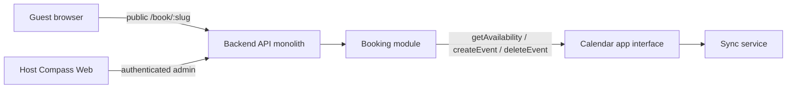

# Compass Calendar Booking (v1)

Locked product spec for public scheduling on Compass Cloud
(`https://compasscalendar.com`). Approved 2026-08-30. Implementation
work packages live in [`wip/booking/`](../../wip/booking/README.md)
until that pack is deleted.

Compass never sends email itself. Google emails the guest when Compass
creates the calendar event with `invitation: "all"`.

## Status

v1 is specified, not shipped. A standalone Compass Booking product
(separate brand, domain, or deployable) is **explicitly deferred**. The
seams below are the extraction path; they are not a second service in
v1.

## Public URL

`https://compasscalendar.com/book/:username`

Example: `https://compasscalendar.com/book/tylerdane`

The username is a `bookingSlug` allocated from the Compass account. It
is not editable in v1. Changing it later is a dedicated migration with
redirects.

Reserved slugs (never allocated): `week`, `day`, `life`, `auth`, `api`,
`cleanup`, `book`, `p`, `settings`, `admin`, `login`, `logout`, `signup`,
`invite`, `calendar`.

### Slug allocation

Compass users have `name` and `email`, not a username
(`packages/core/src/types/user.types.ts`). Allocate `bookingSlug` once
when the host first enables booking:

1. Slugify `name`: lowercase, keep `[a-z0-9]` only, so `Tyler Dane`
   becomes `tylerdane`.
2. If the result is shorter than 3 characters, slugify the email
   local-part the same way.
3. If still too short, use `user` plus the last 6 characters of the user
   id.
4. Truncate to 32 characters.
5. If the candidate is reserved or already taken, append `2`, `3`, …
   until unique.

Store the slug on a booking-owned profile row keyed by Compass user id
(not on Sync connection records). Unique index on `bookingSlug`.

## Product shape

v1 is **one booking page per Compass user**, with one duration. Multiple
appointment types are a later collection, not a v1 field.

### Host

The host must be an authenticated, Google-connected, writable Compass
user. Anonymous IndexedDB users do not get a booking link.
Password-only users see a connect-Google prompt in Settings, not a
broken public page.

Host administration lives in Settings as a new page (today
`SettingsPage` is `"accounts" | "billing"` in
`packages/web/src/settings/settings.store.ts`). There is no dedicated
`/booking` host app in v1.

### Guest

The guest is unauthenticated. They open the public URL, pick a slot
shown in **their browser timezone**, enter name + email (optional
notes), and confirm. They do not need a Compass account.

### Outcome

On confirm, Compass creates a timed Google Calendar event on the
host's destination calendar, invites the guest, auto-adds a Google
Meet link, and Google emails the invite. Compass shows a confirmation
screen with the booked time (guest timezone) and a cancel link.

**Event title:** `{Guest name} and {Host name}`.

**Event description:** guest notes (if any) plus the cancel URL.

**No reschedule in v1.** The guest cancels and rebooks. The host can
delete the calendar event as usual.

## Host inputs

One booking-page record per user.

| Input | v1 rule |
| --- | --- |
| Duration | `15` / `30` / `45` / `60` minutes. Default `30`. Custom minutes later. |
| Destination calendar | Writable Google calendar (`canWrite`). Receives the created event. |
| Blocking calendars | Calendars whose busy intervals occupy slots. Any calendar the host can read availability for, including `freeBusyReader`. Default: every imported calendar on the destination account. |
| General availability | Weekly intervals in the **host booking timezone**. Empty weekday = unavailable. Default timezone: the timezone currently in the host's calendar view when they first enable booking. |
| Scheduling window | Minimum notice default **4 hours**. Maximum horizon default **60 days**. The 60-day cap matches Sync's busy-query bound (`BUSY_QUERY_MAX_WINDOW_MS` in `packages/core/src/types/sync/availability.contracts.ts`). |
| Buffer | Off by default. When on, **30 minutes between appointments**, applied to both sides of a booked slot so two meetings cannot sit adjacent. |
| Max bookings per day | Off by default. When on, default **4**. Counts confirmed booking reservations that day in the host timezone, not every calendar event. |
| Guest permissions | Maps to Google `guestsCanInviteOthers`. Default **on**. This is not Compass UI. `guestsCanModify` stays off. |

**Slot grid:** 15-minute starts in the host timezone, filtered so a slot
of `duration` fits inside an availability interval after buffers and busy
blocks.

## Busy occupancy

v1 uses **Sync busy intervals**, not a new RSVP filter.

- Occupied = an occurrence with `busy: true` and `cancelled: false`
  (`listBusyOverlapping` in
  `packages/sync/src/storage/repositories/event-occurrence.repository.ts`).
- Transparent / free events do not block. Google typically marks
  declined events transparent.
- Confirm **fail-closed**: if Sync returns `bookable: false` (stale,
  unhealthy, or incomplete), the slot is not offered and confirm is
  rejected (`409`). Policy stays in Booking; Sync stays facts-only.
  See [Product Suite Boundaries](../architecture/product-suite-boundaries.md).

Known gap (WP-02): occurrence projection currently forces `busy: true`
(`packages/sync/src/domain/occurrence-projection.ts`). Google already
normalizes transparency; `provider-page-applier.ts` stores
`providerMetadata.transparency = "transparent"` for free events.
Booking cannot ship until occurrences honor that flag. Cancelled
occurrences stay excluded.

RSVP-strict "only organized or accepted invites block" is **v1.1**,
not v1.

## Guest cancel

- Confirmation page and event description include a tokenized cancel URL.
- Token is unguessable and stored hashed on the reservation.
- Cancel deletes the calendar event (host as organizer) and marks the
  reservation cancelled. Idempotent: a second cancel is a no-op success.
- Expired / unknown tokens return a generic not-found page, not a
  leak of whether the booking existed.

## Architecture

Stay in this monorepo. Booking owns rules and reservations. Calendar and
Sync own events and busy. No Booking microservice in v1.

- **Contracts:** Zod in `packages/core` (`@core/types/booking.*.ts`).
  Domain entrypoints (`@compass/contracts/booking`) wait until the
  AGENTS.md contract-placement rule actually changes.
- **Persistence:** Booking-owned Mongo collections (page config,
  reservations). Calendar collections stay Calendar/Sync-owned.
  Cross-domain references are stable ids only.
- **Web:** same Compass Web deploy. Public `/book/$username` routes do
  **not** sit under the authenticated layout and must lazy-load a small
  booking bundle so the keyboard-first calendar does not boot.
- Native iOS/desktop later call the same Booking HTTP contracts. They do
  not import web views.
- Confirm path: compute slots from availability + busy; on submit,
  re-query Sync with `purpose: "booking_confirmation"`, then
  `Calendar.createEvent` with the guest as attendee, `invitation: "all"`,
  Meet create-request, and `guestsCanInviteOthers` from the page setting.
  A race on the same slot: the second confirm fails; no double event.

Public API must be rate-limited (IP + slug), never leak event titles or
attendees (busy intervals only), and must not require a SuperTokens
session.

## HTTP sketch (normative for WP-01)

Unauthenticated:

- `GET /api/booking/pages/:slug` — public page (host display name,
  duration, timezone, enabled). `404` when missing or disabled.
- `GET /api/booking/pages/:slug/slots?start=&end=&timeZone=` — bookable
  instants in the guest timezone. Window must be within the 60-day
  horizon.
- `POST /api/booking/pages/:slug/reservations` — `{slotStart, guestName,
  guestEmail, notes?, guestTimeZone}`. Re-checks busy, then creates.
- `POST /api/booking/reservations/:id/cancel` — `{token}`.

Authenticated (host session + writable billing, same as event writes):

- `GET /api/booking/page` — host page, including slug and copyable URL.
- `PUT /api/booking/page` — replace settings. Allocates slug on first
  enable.
- Enabling without a healthy Google connection is a typed `403`.

## Out of v1

- Multiple event types / appointment types
- Custom intake questions
- Paid booking
- Team pages and round-robin
- Guest reschedule
- Compass-sent email or SMS
- `guestsCanModify`
- RSVP-strict occupancy
- Editable slug
- Standalone booking brand, domain, or deployable
- Production billing packaging specific to booking (uses the existing
  calendar write gate)
- Non-Google destination calendars

## Implementation

Until WP-09 closeout, work packages and the GitHub Project are the
execution record:

- [`wip/booking/README.md`](../../wip/booking/README.md)
- [`wip/booking/TRACKING.md`](../../wip/booking/TRACKING.md)

## Related docs

- [Product Suite Boundaries](../architecture/product-suite-boundaries.md)
- [Event Domain Model](../architecture/event-domain-model.md)
- [Attendees, Contacts, And RSVP](./attendees.md)
- [Google Sync And SSE Flow](./google-sync-and-sse-flow.md)
- [Billing And Trial](./billing.md)
