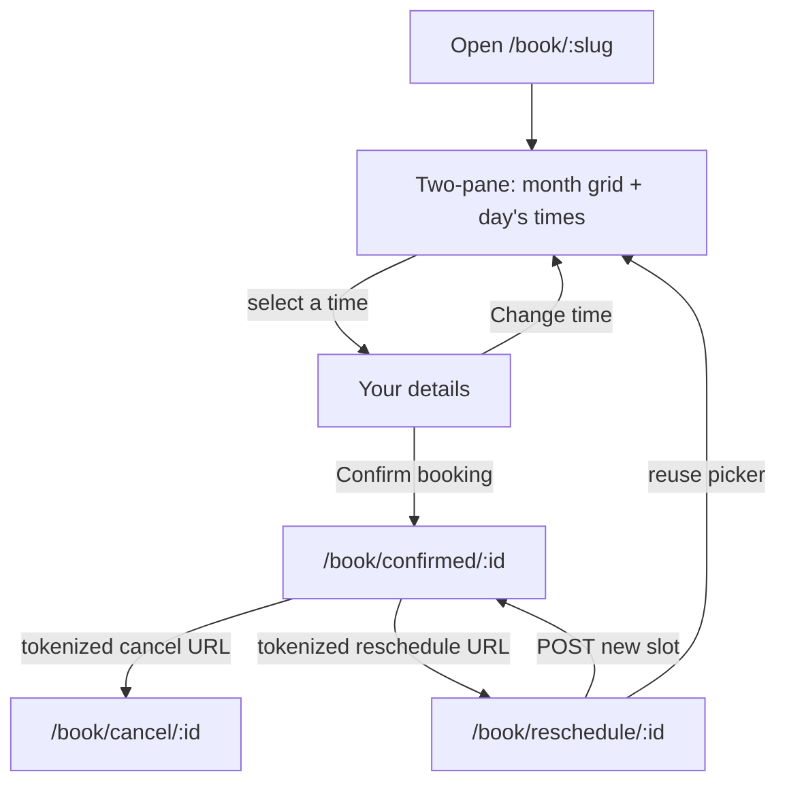
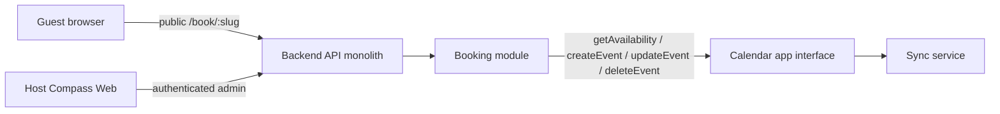

# Compass Calendar Booking (v1 / v1.1 / v1.3)

Locked product spec for public scheduling on Compass Cloud
(`https://compasscalendar.com`). Approved 2026-08-30. v1.1 shipped
RSVP-strict occupancy and public page identity (date-specific
availability exceptions were removed in v1.2). v1.3 adds guest
reschedule. v1.3 is the current staging milestone.

Compass never sends email itself. Google emails the guest when Compass
creates the calendar event with `invitation: "all"`.

## Status

v1 and v1.1 are implemented in the Compass monorepo (public
`/book/:username`, host Settings, backend APIs). v1.3 (guest reschedule)
is specified here and implemented on the Booking v1.3 milestone. Booking
is enabled in development and staging (`runtime.nodeEnv` other than
`production`) and disabled in production. Do not flip `isBookingEnabled`.
A standalone Compass Booking product (separate brand, domain, or
deployable) is **explicitly deferred**. The seams below are the
extraction path; they are not a second service in v1.

## Public URL

`https://compasscalendar.com/book/:username`

Example: `https://compasscalendar.com/book/tylerdane`

The username is a `bookingSlug` allocated from the Compass account. It
is not editable in v1. Changing it later is a dedicated migration with
redirects.

The guest's selection lives in `/book/:slug` search params
(`?month=&date=&slot=&tz=`): Back returns from the details step to the
picker, refresh keeps the selection, and the link is shareable. Invalid
params drop to defaults; they never error.

Confirmation permalink: `/book/confirmed/:reservationId?token=…`.
The cancel (and post-confirm edit) capability is that unguessable token,
not the reservation id. Just-confirmed navigation writes `?token=` into
the permalink so a reload, bookmark, or self-sent link keeps cancel and
edit. The public reservation GET does not return `cancelUrl` or the
token. A permalink without `token` still shows the booking from GET,
with no cancel or edit actions, and does not tell the guest to look for
a cancel link in the invite: that URL is omitted from the event
description when guests can invite others, which is the default.
Reschedule copy stays history-only (v1.3).

Cancel: `/book/cancel/:reservationId?token=…`.

Reschedule: `/book/reschedule/:reservationId?token=…`.

Reserved slugs (never allocated): `week`, `day`, `life`, `auth`, `api`,
`cleanup`, `book`, `cancel`, `confirmed`, `reschedule`, `p`, `settings`,
`admin`, `login`, `logout`, `signup`, `invite`, `calendar`.

### Slug allocation

Compass users have `name` and `email`, not a username
(`packages/core/src/types/user.types.ts`). Allocate `bookingSlug` once
when the host first enables booking:

1. Slugify `name`: lowercase, keep `[a-z0-9]` only, so `Tyler Dane`
   becomes `tylerdane`.
2. If the result is shorter than 3 characters, slugify the email
   local-part the same way.
3. If still too short, use `user` plus the last 6 characters of the user
   id.
4. Truncate to 32 characters.
5. If the candidate is reserved or already taken, append `2`, `3`, …
   until unique.

Store the slug on a booking-owned profile row keyed by Compass user id
(not on Sync connection records). Unique index on `bookingSlug`.

## Product shape

v1 is **one booking page per Compass user**, with one duration. Multiple
appointment types are a later collection, not a v1 field.

### Host

The host must be an authenticated, Google-connected, writable Compass
user. Anonymous IndexedDB users do not get a booking link.
Password-only users see a connect-Google prompt in Settings, not a
broken public page.

Host administration lives in Settings as a Booking page
(`SettingsPage` includes `"booking"` in
`packages/web/src/settings/settings.store.ts`). There is no dedicated
`/booking` host app in v1.

### Guest

The guest is unauthenticated. They open the public URL, pick a day on
the **month grid** and a time from that day's list, shown in **their
timezone** (browser default, overridable), enter name + email (optional
notes), and confirm. They do not need a Compass account.

Public booking uses `light-beach` when `compass.theme` is unset. A
stored theme wins.

### Guest keyboard path

Public booking is click-first and fully keyboard operable. Visible
focus uses the accent ring. Intended Tab order on the picker:

1. **Skip to open times** (focus-revealed link) jumps to **Pick a time**,
   skipping the month grid.
2. Timezone control, then previous/next month, then one tab stop on the
   selected day (arrow keys move among days).
3. One tab stop on that day's times (arrow keys move among slots, Home
   and End jump to first and last). Enter or Space on a day moves focus
   to the first slot. Enter or Space on a slot opens **Your details**
   and moves focus to that heading. **Skip to your details** is the
   first tab stop on that step.
4. **Change time**, then name, email, notes, **Confirm booking**.
   **Change time** returns focus to **Pick a time**.
5. After confirm, `/book/confirmed/:id` focuses **You are booked with
   {host}**. Unknown, cancelled, and load-error states focus their
   headings.
6. A 409 conflict focuses the alert. Slot-load retry focuses **Pick a
   time**. Jump to next available day does the same.
7. Cancel (`/book/cancel/:id`) focuses its heading on load and after
   each state change. Tab then reaches **Cancel this booking**.
8. Reschedule (`/book/reschedule/:id`) focuses **Reschedule your booking
   with {host}** on load and after each state change. Tab then reaches
   the picker (same month grid and slot list as the public page), then
   **Confirm**. A 409 conflict focuses the alert. Missing or invalid
   token focuses the not-found heading.

The month grid stays in the DOM ahead of the slot list. The skip link
exists so keyboard users are not forced through every day cell before
times (and, on details, before the form).

### Outcome

On confirm, Compass creates a timed Google Calendar event on the
host's destination calendar, invites the guest, auto-adds a Google
Meet link, and Google emails the invite. Compass shows a confirmation
screen with the booked time (guest timezone). Cancel and edit-details
are present when the permalink carries `?token=`. Reschedule links stay
history state only (v1.3).

**Event title:** `{Guest name} and {Host name}`.

**Event description:** guest notes (if any). The cancel URL and
reschedule URL are included only when "Guest can invite others" is
off: those URLs are capabilities, and invitees see the description, so
with invites open the guest keeps them from the confirmation page
instead.

## Host inputs

One booking-page record per user.

| Input | v1 rule |
| --- | --- |
| Duration | `15` / `30` / `45` / `60` minutes. Default `30`. Custom minutes later. |
| Destination calendar | Writable Google calendar (`canWrite`). Receives the created event. |
| Blocking calendars | Calendars whose busy intervals occupy slots. Any calendar the host can read availability for, including `freeBusyReader`. Default: every imported calendar on the destination account. |
| General availability | Weekly intervals in the **host booking timezone**. Empty weekday = unavailable. Default timezone: the timezone currently in the host's calendar view when they first enable booking. |
| Welcome text | Optional host-authored line (max 500 characters) shown under the public name. |
| Scheduling window | Minimum notice default **4 hours**. Maximum horizon default **60 days**. The 60-day cap matches Sync's busy-query bound (`BUSY_QUERY_MAX_WINDOW_MS` in `packages/core/src/types/sync/availability.contracts.ts`). |
| Buffer | Off by default. When on, **30 minutes between appointments**, applied to both sides of a booked slot so two meetings cannot sit adjacent. |
| Max bookings per day | Off by default. When on, default **4**. Counts confirmed booking reservations that day in the host timezone, not every calendar event. |
| Guest permissions | Maps to Google `guestsCanInviteOthers`. Default **on**. This is not Compass UI. `guestsCanModify` stays off. |

**Slot grid:** 15-minute starts in the host timezone, filtered so a slot
of `duration` fits inside an availability interval after buffers and busy
blocks.

### Host Settings controls

The Settings **Booking** page is keyboard-first. It is not a native
timezone `<select>` plus a checkbox and two time inputs per weekday.

- **Timezone** uses the same searchable combobox as time travel. The
  trigger is one tab stop and still renders a stored non-canonical alias.
- **Weekly hours** are one typed range per weekday (`9-5`, or `9-12, 1-5`
  for a break). A blank day is unavailable. The parser reuses
  `parseUserTime` with an explicit PM-correction rule.
- **Jump:** `e` then a letter focuses a field (`e` enable, `d` duration,
  `c` destination, `b` blocking, `z` timezone, `h` hours, `w` welcome,
  `n` notice, `x` horizon, `o` buffer and limits, `l` link). Settings
  owns Mod+Enter (save) and digits `1/2/3` (nav) on this page, which is
  why the leader is `e` rather than `Mod+digit`. Focus uses
  `data-booking-field` and does not click, so jumping onto a checkbox
  does not toggle it.
- **Save:** a successful save that returns a booking URL copies it. A
  page that has never been enabled has no slug yet, so the toast says to
  enable booking instead. Safari can drop a copy that follows the save
  round trip; the toast then names `e` then `l`, and the Copy button
  stays.
- **Open booking page** sits next to Copy and opens the public URL in a
  new tab. There is no authenticated preview iframe.

## Busy occupancy

v1.1 occupancy is RSVP-strict. Sync still returns facts only; Booking
decides whether a busy interval occupies a slot
(`packages/core/src/booking/occupies-booking-slot.ts`).

- Occupied = an occurrence with `busy: true` and `cancelled: false`,
  **and** the host is the organizer **or** has accepted.
- `needsAction`, declined, and tentative invites do not occupy.
- Transparent / free events do not block. Cancelled occurrences stay
  excluded.
- Legacy busy intervals with no occupancy facts still occupy (fail
  closed to the pre-v1.1 busy-only behavior).
- Confirm **fail-closed**: if Sync returns `bookable: false` (stale,
  unhealthy, or incomplete), the slot is not offered and confirm is
  rejected (`409`). See
  [Product Suite Boundaries](../architecture/product-suite-boundaries.md).
- The public busy wire never includes titles, attendees, or emails.
  Optional facts are `hostIsOrganizer` and `hostResponseStatus` only.

## Guest cancel

- Confirmation page includes a tokenized cancel URL when `?token=` is on
  the permalink (just-confirmed navigation writes it there). The event
  description carries it too only when guests cannot invite others (see
  above). A permalink without the token does not invent a cancel path.
- Token is unguessable and stored hashed on the reservation as
  `cancelTokenHash`.
- Cancel deletes the calendar event (host as organizer) and marks the
  reservation cancelled. Idempotent: a second cancel is a no-op success.
- Expired / unknown tokens return a generic not-found page, not a
  leak of whether the booking existed.

## Guest reschedule (v1.3)

Guest-only. Hosts keep editing or deleting the calendar event in Compass.
There is no host reservation inbox.

- Reuses `cancelTokenHash` / `?token=`. No second secret.
- Confirmation shows **Reschedule** (link + **Copy reschedule link**) next
  to cancel when history state has `rescheduleUrl`. Cold permalink has
  neither reschedule secret. Cancel and edit use `?token=` on the
  confirmation URL (see Guest cancel).
- `/book/reschedule/:id?token=` reuses the public month/slot picker. Do
  not re-collect name, email, or notes. Duration comes from current page
  settings (same in-flight duration wart as confirm).
- In-place Google PATCH of the existing event: same `calendarEventId`,
  same Meet URL, same attendees. `invitation: "all"`,
  `attendeesEdit: "preserve"`. Compass still sends no email.
- While choosing a new time, this reservation must not occupy slots or
  count toward max-per-day. Other overlapping host events still occupy.
  Tokenized slots: `GET /api/booking/reservations/:id/slots`.
- Status stays `confirmed`; mutate `slotStart` / `slotEnd`. Same slot is
  an idempotent success (no second Google write). Cancelled or bad token
  → same generic not-found as cancel. New slot re-check uses
  `purpose: "booking_confirmation"`; race → `409`.

## Architecture

Stay in this monorepo. Booking owns rules and reservations. Calendar and
Sync own events and busy. No Booking microservice in v1.

- **Contracts:** Zod in `packages/core` (`@core/types/booking.*.ts`).
  Domain entrypoints (`@compass/contracts/booking`) wait until the
  AGENTS.md contract-placement rule actually changes.
- **Persistence:** Booking-owned Mongo collections (page config,
  reservations). Calendar collections stay Calendar/Sync-owned.
  Cross-domain references are stable ids only.
- **Web:** same Compass Web deploy. Public `/book/$username` routes do
  **not** sit under the authenticated layout and must lazy-load a small
  booking bundle so the keyboard-first calendar does not boot.
- Native iOS/desktop later call the same Booking HTTP contracts. They do
  not import web views.
- Confirm path: compute slots from availability + busy; on submit,
  re-query Sync with `purpose: "booking_confirmation"`, then
  `Calendar.createEvent` with the guest as attendee, `invitation: "all"`,
  Meet create-request, and `guestsCanInviteOthers` from the page setting.
  A race on the same slot: the second confirm fails; no double event.
  Reschedule re-queries the same way, PATCHes the existing event
  (`invitation: "all"`, `attendeesEdit: "preserve"`), and keeps
  `calendarEventId`.

Public API must be rate-limited (IP + slug), never leak event titles or
attendees (busy intervals only), and must not require a SuperTokens
session.

## HTTP sketch (normative)

Unauthenticated:

- `GET /api/booking/pages/:slug` — public page (host display name,
  duration, timezone, enabled, optional welcome text). `404` when
  missing or disabled.
- `GET /api/booking/pages/:slug/slots?start=&end=&timeZone=` — bookable
  instants in the guest timezone for that window. The guest UI requests
  **one month at a time** (plus prefetch of adjacent months). Window
  must be within the 60-day horizon.
- `POST /api/booking/pages/:slug/reservations` — `{slotStart, guestName,
  guestEmail, notes?, guestTimeZone}`. Re-checks busy, then creates.
- `GET /api/booking/reservations/:id` — public confirmation payload
  (`slotStart`, `guestTimeZone`, `durationMinutes`, `hostDisplayName`,
  `status`, `bookingSlug`, `guestName`, `notes`). `404` when missing. No
  guest email or cancel token.
- `PATCH /api/booking/reservations/:id` — `{token, name?, notes?}`. Verify
  token. Updates the reservation and rewrites the calendar event title and
  description. Guest email is not accepted. `404` when missing, cancelled, or
  the token is invalid.
- `POST /api/booking/reservations/:id/cancel` — `{token}`.
- `GET /api/booking/reservations/:id/slots?token=&start=&end=&timeZone=`
  — bookable instants excluding this reservation from occupancy and
  max-per-day. Verify token. `404` when missing or invalid.
- `POST /api/booking/reservations/:id/reschedule` — `{token, slotStart,
  guestTimeZone}`. Re-checks busy excluding self, PATCHes the event,
  updates reservation times. Create response also includes
  `rescheduleUrl`.

Authenticated (host session + writable billing, same as event writes):

- `GET /api/booking/page` — host page, including slug and copyable URL.
- `PUT /api/booking/page` — replace settings. Allocates slug on first
  enable.
- Enabling without a healthy Google connection is a typed `403`.

## Out of v1 / v1.1

Guest reschedule is **in scope for v1.3**, not v1 / v1.1.

- Multiple event types / appointment types
- Custom intake questions
- Paid booking
- Team pages and round-robin
- Compass-sent email or SMS
- `guestsCanModify`
- Editable slug
- Standalone booking brand, domain, or deployable
- Production billing packaging specific to booking (uses the existing
  calendar write gate)
- Non-Google destination calendars
- Flipping the production gate
- Host reservation inbox
- Meet URL on the confirmation screen (Google creates conference
  asynchronously; the invite email already has it)

## Implementation

### Implementation map

| Area | Path |
| --- | --- |
| Shared contracts | `packages/core/src/types/booking.contracts.ts` |
| Slot engine | `packages/core/src/booking/compute-booking-slots.ts` |
| Occupancy policy | `packages/core/src/booking/occupies-booking-slot.ts` |
| Backend admin API | `packages/backend/src/booking/controllers/booking.controller.ts`, `services/booking-page.service.ts` |
| Backend public API | `packages/backend/src/booking/services/public-booking.service.ts` |
| Reservations + cancel tokens | `packages/backend/src/booking/booking-reservation.repository.ts`, `booking-cancel-token.ts` |
| Calendar application port | `packages/backend/src/booking/services/calendar-booking.port.ts`, `services/calendar-booking.service.ts` |
| Sync busy occupancy | `packages/sync/src/domain/occurrence-projection.ts`, `busy-query.service.ts`, `booking-occupancy-facts.ts` |
| Host Settings UI | `packages/web/src/booking/BookingSettingsSection.tsx`, `packages/web/src/components/Settings/SettingsModal.tsx` |
| Public guest UI | `packages/web/src/booking/PublicBookingPage.tsx`, `PublicBookingConfirmedPage.tsx`, `PublicBookingCancelPage.tsx` |
| Public web API client | `packages/web/src/api/public-booking.api.ts` |
| E2e | `e2e/booking/`, `e2e/accessibility/booking-a11y.spec.ts` |

### Named warts

- **Guest email is not editable after confirm.** The attendee identity and
  Google invite are bound to the address collected at booking. Changing it
  would send a new invitation, which v1.5 does not do.
- **Slug is not editable in v1.** Allocation runs once on first enable; changing
  slugs needs a migration with redirects.
- **Guest reschedule is v1.3, not v1.** In-place PATCH; same cancel token.
  Host-edited events still use `expectedVersion: null` on the booking
  update path.
- **Confirm is fail-closed.** When Sync reports `bookable: false`, slots
  disappear and confirm returns `409`.
- **Google-only destination** calendars; password-only hosts see a connect-Google
  prompt in Settings.
- **A duration change re-prices in-flight confirms.** A guest who picked a
  slot before the host changed the duration books at the new duration when
  the engine still allows that start (the server recomputes `slotEnd` from
  current settings); otherwise the re-check rejects with `409` and the guest
  re-picks. Accepted for v1.

## Related docs

- [Product Suite Boundaries](../architecture/product-suite-boundaries.md)
- [Event Domain Model](../architecture/event-domain-model.md)
- [Attendees, Contacts, And RSVP](./attendees.md)
- [Google Sync And SSE Flow](./google-sync-and-sse-flow.md)
- [Billing And Trial](./billing.md)
- Product audit prompt (next-milestone recommendations, not the booking loop):
  [`.github/prompts/booking-product-audit.md`](../../.github/prompts/booking-product-audit.md)
