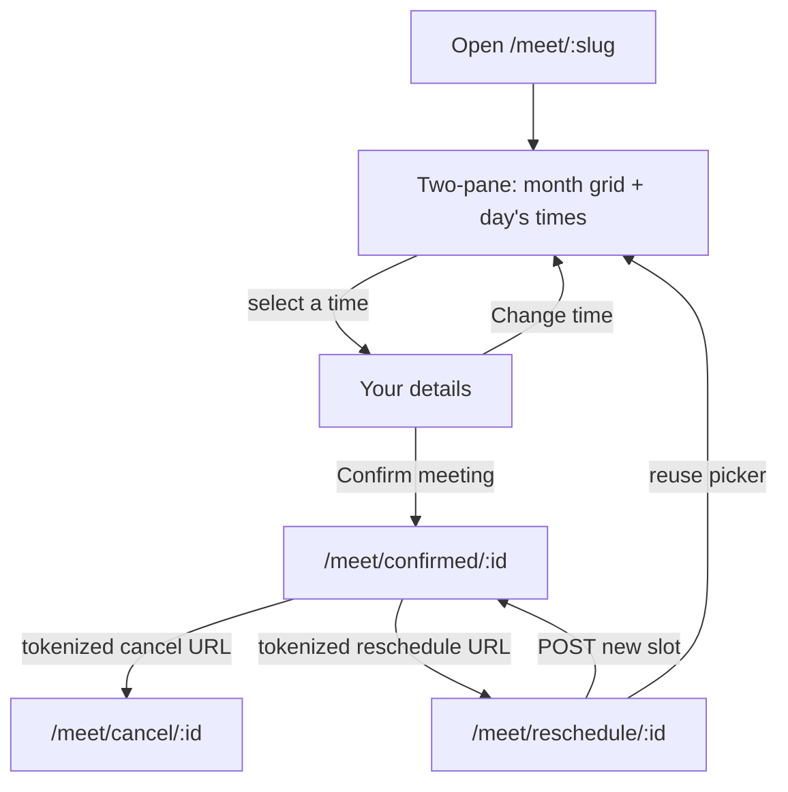

# Compass Calendar Booking (v1 / v1.1 / v1.3 / v1.5 / v1.6 / v1.7)

Locked product spec for public scheduling on Compass Cloud
(`https://compasscalendar.com`). Approved 2026-08-30. v1.1 shipped
RSVP-strict occupancy and public page identity (date-specific
availability exceptions were removed in v1.2). v1.5 shipped keyboard
Escape paths, guest edit-details after confirm, confirmation permalink
tokens, and the audit fixes on milestone Booking v1.5. v1.3 (guest
reschedule) is specified here and implemented. v1.6 shipped one-click
turn on, Essentials / More options, editable address, default hours,
branded connect pills, and funnel analytics. v1.7 shipped the Meeting
page redesign: `/meet` URLs, meeting copy, hold-Mod section chords, the
on/off switch, grouped weekly hours rows, and the first-run address
screen. v1.8 replaces that address screen with a guided setup wizard.
The production gate stays off.

Compass never sends email itself. Google emails the guest when Compass
creates the calendar event with `invitation: "all"`.

## Status

v1, v1.1, v1.3, v1.5, v1.6, and v1.7 are implemented in the Compass
monorepo (public `/meet/:username`, host Settings, backend APIs, guest
cancel, guest reschedule, edit-details, one-click turn on, Essentials /
More options, editable address, default hours, branded connect pills,
funnel analytics, meeting copy, hold-Mod section chords, the on/off
switch, grouped weekly hours, and the guided first-run setup wizard). Booking
is enabled in development and staging (`runtime.nodeEnv` other than
`production`) and disabled in production. Do not flip `isBookingEnabled`.
A standalone Compass Booking product (separate brand, domain, or
deployable) is **explicitly deferred**. The seams below are the
extraction path; they are not a second service in v1.

## Public URL

`https://compasscalendar.com/meet/:username`

Example: `https://compasscalendar.com/meet/tyler-dane`

The username is a `bookingSlug` on the host's Meeting page. Hosts choose it
in Settings before or after enabling. Interior hyphens are allowed (for
example `tyler-dane`). Changing the address overwrites the stored slug;
old slug links stop working and there are no slug redirects.

Legacy `/book` username, cancel, reschedule, and confirmed links still
work through client-side redirect routes that keep the search params
(`?token=` rides on cancel and reschedule links). API paths stay
`/api/booking/*`.

The guest's selection lives in `/meet/:slug` search params
(`?month=&date=&slot=&tz=`): Back returns from the details step to the
picker, refresh keeps the selection, and the link is shareable. Invalid
params drop to defaults; they never error.

Confirmation permalink: `/meet/confirmed/:reservationId?token=…`.
The cancel (and post-confirm edit) capability is that unguessable token,
not the reservation id. Just-confirmed navigation writes `?token=` into
the permalink so a reload, bookmark, or self-sent link keeps cancel and
edit. The public reservation GET does not return `cancelUrl` or the
token. A permalink without `token` still shows the booking from GET,
with no cancel or edit actions. Cancel and reschedule links always appear in
the event description because guests cannot invite others.
Reschedule copy stays history-only (v1.3).

Cancel: `/meet/cancel/:reservationId?token=…`.

Reschedule: `/meet/reschedule/:reservationId?token=…`.

Reserved slugs (never allocated): `week`, `day`, `life`, `auth`, `api`,
`cleanup`, `book`, `meet`, `cancel`, `confirmed`, `reschedule`, `p`,
`settings`, `admin`, `login`, `logout`, `signup`, `invite`, `calendar`.

### Slug allocation

Compass users have `name` and `email`, not a username
(`packages/core/src/types/user.types.ts`). When the host opens Booking
Settings for the first time, a guided wizard asks one question per
screen: address, weekly hours, duration, destination (only when more than
one writable calendar exists), then go live. **Continue** on the address
step (Enter, `k`, or Mod+Enter) saves a draft (`PUT` with `enabled: false`)
so "That address is already taken" shows on that screen. `j` and Esc go
back a step; Esc on the first step closes Settings. Go live turns the page
on, copies the link, and opens the full form. Reopening Settings after the
draft exists lands on the normal page with the switch off.
The host may replace the address later under More options; a draft keeps
its chosen address even while disabled.

When no slug is stored yet and the host enables without choosing one,
allocate `bookingSlug` once:

1. Slugify `name`: lowercase, keep `[a-z0-9]` only, so `Tyler Dane`
   becomes `tylerdane`.
2. If the result is shorter than 3 characters, slugify the email
   local-part the same way.
3. If still too short, use `user` plus the last 6 characters of the user
   id.
4. Truncate to 32 characters.
5. If the candidate is reserved or already taken, append `2`, `3`, …
   until unique.

Store the slug on a booking-owned profile row keyed by Compass user id
(not on Sync connection records). Unique index on `bookingSlug`.

## Product shape

v1 is **one Meeting page per Compass user**, with one duration. Multiple
appointment types are a later collection, not a v1 field.

### Host

The host must be an authenticated Compass user with a healthy,
writable calendar connection. Anonymous IndexedDB users do not get a
booking link. Password-only users see a connect-Google prompt in
Settings, not a broken public page.

Host administration lives in Settings as Meeting. The internal name
remains Booking page (`SettingsPage` includes `"booking"` in
`packages/web/src/settings/settings.store.ts`). There is no dedicated
`/booking` host app in v1.

### Guest

The guest is unauthenticated. They open the public URL, pick a day on
the **month grid** and a time from that day's list, shown in **their
timezone** (browser default, overridable), enter name + email (optional
notes), and confirm. They do not need a Compass account.

Public booking uses `light-beach` when `compass.theme` is unset. A
stored theme wins.

### Guest keyboard path

Public booking is click-first and fully keyboard operable. Visible
focus uses the accent ring. Intended Tab order on the picker:

1. **Skip to open times** (focus-revealed link) jumps to **Pick a time**,
   skipping the month grid.
2. Timezone control, then previous/next month, then one tab stop on the
   selected day (arrow keys move among days).
3. One tab stop on that day's times (arrow keys move among slots, Home
   and End jump to first and last). Enter or Space on a day moves focus
   to the first slot. Enter or Space on a slot opens **Your details**
   and moves focus to that heading. **Skip to your details** is the
   first tab stop on that step.
4. **Change time**, then name, email, notes, **Confirm meeting**.
   **Change time** returns focus to **Pick a time**.
5. After confirm, `/meet/confirmed/:id` focuses **You're meeting with
   {host}**. Unknown, cancelled, and load-error states focus their
   headings.
6. A 409 conflict focuses the alert. Slot-load retry focuses **Pick a
   time**. Jump to next available day does the same.
7. Cancel (`/meet/cancel/:id`) focuses its heading on load and after
   each state change. Tab then reaches **Cancel this meeting**.
8. Reschedule (`/meet/reschedule/:id`) focuses **Reschedule your meeting
   with {host}** on load and after each state change. Tab then reaches
  the picker (same month grid and slot list as the public page), then
  **Confirm**. A 409 conflict focuses the alert. Missing or invalid
  token focuses the not-found heading.

The month grid stays in the DOM ahead of the slot list. The skip link
exists so keyboard users are not forced through every day cell before
times (and, on details, before the form).

### Escape

Escape peels one layer. OverlayPanel (timezone picker, discard confirm)
holds the app lock first.

- **Your details:** Escape is **Change time**. Focus returns to **Pick a
  time**.
- **Timezone overlay:** Escape closes the overlay and leaves the current
  step (picker or details) in place.
- **Slot list:** Escape moves focus to the selected day. It does not
  change the URL.
- **Month grid:** Escape is a no-op. It does not leave `/meet/:slug`.
- **Confirmation** (`/meet/confirmed/:id`): Escape returns to
  `/meet/:bookingSlug` and focuses **Meet with {host}**. Unknown,
  cancelled, and load-error states have no slug path and stay put.
- **Edit details:** Escape returns to confirmation without PATCHing.
- **Cancel confirm** (`/meet/cancel/:id`): Escape returns to
  `/meet/confirmed/:id` with the same `?token=` and does not POST.
  In-flight cancel does not navigate or abort.

### Outcome

On confirm, Compass creates a timed event on the host's destination
calendar, invites the guest, and adds a conference link when the
destination supports one (Google Meet, Microsoft Teams, or none). The
provider emails the invite. Compass shows a confirmation screen with the
booked time (guest timezone) and names that conference kind. Cancel and
edit-details are present when the permalink carries `?token=`.
Reschedule links stay history state only (v1.3).

**Event title:** `{Guest name} and {Host name}`.

**Event description:** guest notes (if any), plus cancel and reschedule
URLs. Guests cannot invite others, so those URLs are safe in the
description every invitee sees.

## Host inputs

One booking-page record per user.

| Input | v1 rule |
| --- | --- |
| Duration | `15` / `30` / `45` / `60` minutes. Default `30`. Custom minutes later. |
| Destination calendar | Writable calendar (`canWriteEvents`) on a healthy connection. Receives the created event. |
| Blocking calendars | Calendars whose busy intervals occupy slots. Any calendar the host can read availability for, including `freeBusyReader`. Default: every imported calendar on the destination account. |
| General availability | Weekly intervals in the **host booking timezone**. Empty weekday = unavailable. Default Mon-Fri 09:00-17:00, shown as one grouped hours row. Turning on requires at least one window (`AVAILABILITY_REQUIRED`). Default timezone: the timezone currently in the host's calendar view when they first enable booking, not UTC. An unconfigured admin GET uses the host's primary calendar timezone. |
| Scheduling window | Minimum notice default **4 hours**, capped at **1440 hours** (the 60-day horizon in hours). Maximum horizon default **60 days**. The 60-day cap matches Sync's busy-query bound (`BUSY_QUERY_MAX_WINDOW_MS` in `packages/core/src/types/sync/availability.contracts.ts`). |

**Slot grid:** 15-minute starts in the host timezone, filtered so a slot
of `duration` fits inside an availability interval after busy blocks.
Back-to-back meetings are allowed; there is no buffer or per-day cap.

### Host Settings controls

The Settings **Meeting** page is keyboard-first. It is split into a
status header, an Essentials group, and a collapsed **More options**
group. It is not a native timezone `<select>` plus a checkbox and two
time inputs per weekday.

- **Status:** a **Meeting page** switch reflects whether the page is
  live. When on, it shows "Live at" and the meeting link with Copy and
  **Open meeting page**. When off, it shows "Off. Turn it on to share
  your link." and the address the page will use.
- **Essentials:** duration, meeting timezone, weekly hours, and
  destination calendar. These fit without scrolling at 1440x900.
- **More options:** an uncontrolled native `
` that starts
  collapsed. It holds page address (with "Links using your old address
  will stop working." when the slug changes), blocking calendars,
  minimum notice, and maximum horizon. Jumping to a field inside it, or
  an invalid field in the group, opens it. Do not control the `open`
  prop from React: the jump-key code opens the element imperatively.
- **First run:** before any draft exists, Meeting is a wizard: Step N of
  M, one heading, one sentence, and the step body. Steps are address
  ("Pick your address"), weekly hours, duration, destination (omitted
  when fewer than two writable calendars), and go live. Address Continue
  saves the draft. `k` continues and `j` goes back when focus is not in
  an editable control. Enter continues from the address input or the
  Continue / Turn on button. Esc goes back one step, or closes Settings
  on step 1. The dirty-form discard prompt is not shown while the wizard
  is mounted.
- **Timezone** uses the same searchable combobox as time travel. The
  trigger is one tab stop and still renders a stored non-canonical alias.
- **Weekly hours** are grouped rows of day pills, a Start menu, the
  word "to", and an End menu. Menus step by 15 minutes with 12-hour
  labels (`9:00 AM`). The default is one row, Mon-Fri, 9:00 AM to
  5:00 PM. **Add hours** starts a row with the days that are still
  unassigned, and is disabled once every day has hours. A weekday
  belongs to at most one row. Days in no row are unavailable. Loading a
  stored day with two intervals keeps only the first.
- **Jump:** hold Mod to see sidebar digits `1/2/3` and Enter on Save
  (or Continue). Meeting fields, legends, summaries, and the Copy
  button have no shortcut chips. `Mod+4` through `Mod+9` and `Mod+U`
  do nothing. Save stays Mod+Enter. Save-error focus still uses
  `data-booking-field` and does not click, so focusing a checkbox does
  not toggle it. Before focusing, the helper opens any ancestor
  `
`. The Settings nav shows one hint, **Hold Mod to see
  shortcuts.**, while chips are hidden.
- **Turn on / Save:** going live is one click on the Meeting page
  switch, which saves immediately with the current form. The save bar
  has one primary **Save changes** (Mod+Enter) that keeps the current
  on or off state. Validation and server errors render beside the save
  bar and focus the offending field. A failed enable leaves the switch
  off.
- **Toasts:** turning on copies the link (`Your meeting page is live.
  Link copied.`, or `Live. Use Copy to share your link.` if the
  clipboard fails). Save changes while on copies the link, or
  `Saved. Use Copy to share your link.` if the clipboard fails. Turn
  off says `Meeting page turned off.` Save changes while off says
  `Saved. Turn on your meeting page to share the link.` Safari can
  drop a copy that follows the save round trip; the Copy button stays.
- **Open meeting page** sits next to Copy and opens the public URL in a
  new tab. There is no authenticated preview iframe.
- **Discard:** Escape on a dirty Booking form opens **Discard unsaved
  changes?** instead of closing Settings. Cancel (Escape) keeps the
  edits. **Discard** (Shift+Escape or Mod+Enter) closes Settings without
  saving.

## Busy occupancy

v1.1 occupancy is RSVP-strict. Sync still returns facts only; Booking
decides whether a busy interval occupies a slot
(`packages/core/src/booking/occupies-booking-slot.ts`).

- Occupied = an occurrence with `busy: true` and `cancelled: false`,
  **and** the host is the organizer **or** has accepted.
- `needsAction`, declined, and tentative invites do not occupy.
- Transparent / free events do not block. Cancelled occurrences stay
  excluded.
- Legacy busy intervals with no occupancy facts still occupy (fail
  closed to the pre-v1.1 busy-only behavior).
- Confirm **fail-closed**: if Sync returns `bookable: false` (stale,
  unhealthy, or incomplete), the slot is not offered and confirm is
  rejected (`409`). See
  [Product Suite Boundaries](../architecture/product-suite-boundaries.md).
- **Cursor-expiry hold-off freshness:** when Sync is holding off
  incremental pulls on a calendar because its watch cursor keeps expiring
  (`cursorExpiredBackoffUntil`), booking treats the resource as fresh for
  the hold-off window plus a short reconcile grace. Sync chose not to poll,
  so the last completed repair stays authoritative; the grace covers the
  sweep lap after hold-off expiry. The rule keys on the hold-off timestamp,
  not watch support, so unwatchable Apple CalDAV calendars still use the
  normal 30-minute `maxAgeMs` gate.
- The public busy wire never includes titles, attendees, or emails.
  Optional facts are `hostIsOrganizer` and `hostResponseStatus` only.

## Guest cancel and edit details

- Confirmation page includes a tokenized cancel URL when `?token=` is on
  the permalink (just-confirmed navigation writes it there). The event
  description always carries cancel and reschedule URLs. A permalink
  without the token does not invent a cancel path.
- **Edit details** uses the same token. Name and notes only; email is not
  on the form and is not accepted on PATCH. **Save details** PATCHes
  `{token, name?, notes?}` and rewrites the Google event title and
  description. **Back** or Escape returns to confirmation without saving.
- Token is unguessable and stored hashed on the reservation as
  `cancelTokenHash`. It stays valid until `slotEnd` and then returns
  the same generic not-found as an unknown token.
- Cancel marks the reservation cancelled, then deletes the calendar
  event (host as organizer, `invitation: "all"`). A failed delete
  still frees the slot; retry deletes while `calendarEventId` remains.
  Idempotent: a second cancel after a successful delete is a no-op.
- Expired / unknown tokens return a generic not-found page, not a
  leak of whether the booking existed.

## Guest reschedule (v1.3)

Guest-only. Hosts keep editing or deleting the calendar event in Compass.
There is no host reservation inbox.

- Reuses `cancelTokenHash` / `?token=`. No second secret.
- Confirmation shows **Reschedule** (link + **Copy reschedule link**) next
  to cancel when history state has `rescheduleUrl`. Cold permalink has
  neither reschedule secret. Cancel and edit use `?token=` on the
  confirmation URL (see Guest cancel and edit details).
- `/meet/reschedule/:id?token=` reuses the public month/slot picker. Do
  not re-collect name, email, or notes. Confirm and reschedule both pin
  `durationMinutes` from the page the guest saw: a mismatch with the
  current page duration is `409`.
- In-place Google PATCH of the existing event: same `calendarEventId`,
  same Meet URL, same attendees. `invitation: "all"`,
  `attendeesEdit: "preserve"`. Compass still sends no email.
- While choosing a new time, this reservation must not occupy slots or
  count toward max-per-day. Other overlapping host events still occupy.
  Tokenized slots: `GET /api/booking/reservations/:id/slots`.
- Status stays `confirmed`; mutate `slotStart` / `slotEnd`. Same slot is
  an idempotent success (no second Google write). Cancelled or bad token
  → same generic not-found as cancel. New slot re-check uses
  `purpose: "booking_confirmation"`; race → `409`.

## Architecture

Stay in this monorepo. Booking owns rules and reservations. Calendar and
Sync own events and busy. No Booking microservice in v1.

- **Contracts:** Zod in `packages/core` (`@core/types/booking.*.ts`).
  Domain entrypoints (`@compass/contracts/booking`) wait until the
  AGENTS.md contract-placement rule actually changes.
- **Persistence:** Booking-owned Mongo collections (page config,
  reservations). Calendar collections stay Calendar/Sync-owned.
  Cross-domain references are stable ids only.
- **Web:** same Compass Web deploy. Public `/meet/$username` routes do
  **not** sit under the authenticated layout and must lazy-load a small
  booking bundle so the keyboard-first calendar does not boot.
- Native iOS/desktop later call the same Booking HTTP contracts. They do
  not import web views.
- Confirm path: compute slots from availability + busy; on submit,
  re-query Sync with `purpose: "booking_confirmation"`, then
  `Calendar.createEvent` with the guest as attendee, `invitation: "all"`,
  `createConference: true` when the destination conference is not
  `none`, and `guestsCanInviteOthers: false` on every create.
  A race on the same slot: the second confirm fails; no double event.
  Reschedule re-queries the same way, PATCHes the existing event
  (`invitation: "all"`, `attendeesEdit: "preserve"`), and keeps
  `calendarEventId`.

Public API must be rate-limited (IP + slug), never leak event titles or
attendees (busy intervals only), and must not require a SuperTokens
session.

## HTTP sketch (normative)

Unauthenticated:

- `GET /api/booking/pages/:slug` — public page (host display name,
  duration, timezone, enabled). `404` when missing or disabled. A host who cannot write is `409` with
  `This page is not accepting meetings.` (no billing, plan, or payment
  wording).
- `GET /api/booking/pages/:slug/slots?start=&end=&timeZone=` — bookable
  instants for that window, computed in the **host** timezone. `timeZone`
  is required (guest rendering and logs) and does not change the slot
  set. The guest UI requests **one month at a time** (plus prefetch of
  adjacent months). Window must be within the 60-day horizon. A host who
  cannot write is `{ slots: [], bookable: false }`.
- `POST /api/booking/pages/:slug/reservations` — `{slotStart, guestName,
  guestEmail, notes?, guestTimeZone, durationMinutes}`. `durationMinutes`
  must match the page. Mismatch is `409` with no Google event. Re-checks
  billing and busy, then creates. A host who cannot write is the same
  `409` as GET page and submits no create command.
- `GET /api/booking/reservations/:id` — public confirmation payload
  (`slotStart`, `guestTimeZone`, `durationMinutes`, `hostDisplayName`,
  `status`, `bookingSlug`, `guestName`, `notes`). `404` when missing. No
  guest email or cancel token.
- `PATCH /api/booking/reservations/:id` — `{token, name?, notes?}`. Verify
  token. Updates the reservation and rewrites the calendar event title and
  description. Guest email is not accepted. `404` when missing, cancelled, or
  the token is invalid.
- `POST /api/booking/reservations/:id/cancel` — `{token}`.
- `GET /api/booking/reservations/:id/slots?token=&start=&end=&timeZone=`
  — bookable instants excluding this reservation from occupancy.
  Same window rules as the public page slots endpoint.
- `POST /api/booking/reservations/:id/reschedule` — `{token, slotStart,
  guestTimeZone, durationMinutes}`. `durationMinutes` must match the page
  (same pin as confirm). In-place calendar PATCH. Same slot is an
  idempotent success. Create response includes `rescheduleUrl`.

Authenticated (host session + writable billing, same as event writes):

- `GET /api/booking/page` — host page, including slug and copyable URL.
- `PUT /api/booking/page` — replace settings. Accepts optional `slug`.
  Allocates slug on first enable when none is stored. `409` with
  `SLUG_TAKEN` when the requested address belongs to another host.
- Enabling without a healthy calendar connection is a typed `403`
  (`CALENDAR_NOT_CONNECTED`; `GOOGLE_NOT_CONNECTED` remains an alias).
- Enabling with zero weekly hours is a typed `400` (`AVAILABILITY_REQUIRED`).

## Out of v1 / v1.1

Guest reschedule is **in scope for v1.3**, not v1 / v1.1.

- Multiple event types / appointment types
- Custom intake questions
- Paid booking
- Team pages and round-robin
- Compass-sent email or SMS
- `guestsCanModify`
- Standalone booking brand, domain, or deployable
- Production billing packaging specific to booking (uses the existing
  calendar write gate)
- Flipping the production gate
- Host reservation inbox
- Meet URL on the confirmation screen (Google creates conference
  asynchronously; the invite email already has it)

## Implementation

### Implementation map

| Area | Path |
| --- | --- |
| Shared contracts | `packages/core/src/types/booking.contracts.ts` |
| Slot engine | `packages/core/src/booking/compute-booking-slots.ts` |
| Occupancy policy | `packages/core/src/booking/occupies-booking-slot.ts` |
| Backend admin API | `packages/backend/src/booking/controllers/booking.controller.ts`, `services/booking-page.service.ts` |
| Backend public API | `packages/backend/src/booking/booking.routes.config.ts`, `services/public-booking.service.ts` |
| Reservations + cancel tokens | `packages/backend/src/booking/booking-reservation.repository.ts`, `booking-cancel-token.ts` |
| Calendar application port | `packages/backend/src/booking/services/calendar-booking.port.ts` (`updateBookingEvent`), `services/calendar-booking.service.ts` |
| Sync busy occupancy | `packages/sync/src/domain/occurrence-projection.ts`, `busy-query.service.ts`, `booking-occupancy-facts.ts` |
| Host Settings UI | `packages/web/src/booking/BookingSettingsSection.tsx`, `packages/web/src/booking/setup/`, `BookingStatusHeader.tsx`, `BookingMoreOptions.tsx`, `BookingSaveBar.tsx`, `BookingAddressField.tsx`, `BookingBlockingCalendarsField.tsx`, `weekly-hours.rows.ts`, `packages/web/src/components/Switch/Switch.tsx`, `packages/web/src/components/Settings/SettingsModal.tsx` |
| Public guest UI | `packages/web/src/booking/PublicBookingPage.tsx`, `PublicBookingConfirmedPage.tsx`, `PublicBookingCancelPage.tsx`, `PublicBookingReschedulePage.tsx`, `PublicBookingCopyGuestAction.tsx`, `PublicBookingEditDetailsForm.tsx` |
| Public web API client | `packages/web/src/api/public-booking.api.ts` |
| E2e | `e2e/booking/`, `e2e/booking/public-booking-reschedule.spec.ts`, `e2e/accessibility/booking-a11y.spec.ts` |

### Analytics

PostHog product events for the nothing-to-live funnel. No guest name, email,
notes, or reservation id. Autocapture already runs on public `/meet/*`
routes; these are the named events in `packages/web/src/auth/posthog/track.ts`.

| Event | Properties | When |
| --- | --- | --- |
| `booking_settings_opened` | `has_connection: boolean`, `is_live: boolean` | Settings > Meeting mounts (after the page is known, or immediately on the connect prompt) |
| `booking_page_enabled` | `first_time: boolean` | Turn-on save succeeds. `first_time` is true when the page had no `bookingUrl` before this save |
| `booking_link_copied` | `source: "button" \| "save"` | Successful copy from the Copy button, or auto-copy after a successful turn-on / save |
| `booking_page_viewed` | `duration_minutes: number` | Public page query succeeds with `enabled: true`, once per slug |
| `booking_reservation_created` | `duration_minutes: number` | Guest confirm mutation succeeds |

### Named warts

- **Public booking rate limits are per process.** `express-rate-limit`
  buckets live in memory on each app replica. The numbers in
  `booking.routes.config.ts` (for example 10 confirms per minute) are
  per instance: N replicas yield about N times that, and a client that
  reconnects to a different replica resets its bucket. Accepted for v1
  while `isBookingEnabled` stays false in production.
- **Cancel, edit, and reschedule tokens travel in the query string.** The
  bearer lives in `?token=` on `/meet/confirmed/:id`, `/meet/cancel/:id`,
  and `/meet/reschedule/:id`, so it can appear in browser history, Referer
  headers, and access logs. Accepted for v1: a fragment or POST landing
  page would break the confirmation permalink. Tokens stop working at
  `slotEnd`.
- **Guest email is not editable after confirm.** The attendee identity and
  Google invite are bound to the address collected at booking. Changing it
  would send a new invitation, which v1.5 does not do.
- **Keyboard-targeted event is not in the event-jump store.** f4 targeting
  lives as a local ref plus DOM focus in the hint hook
  (`packages/web/src/shortcuts/shift-hint/event-jump.store.ts`). Enter has
  nothing in that store to check. Recorded in WP-12; do not fold targeting
  into the store in a drive-by.
- **Changing the booking address breaks old links.** The host may edit the
  slug in Settings; the stored value is overwritten with no previous-slug
  list and no redirect. Public resolution 404s the old slug after a rename.
- **Host-edited etag overwrite uses `expectedVersion: null`.** Guest
  reschedule PATCHes the same Google event in place. Host-edited events
  still omit a stored etag on the booking update path, so a concurrent
  host edit can be overwritten. Accepted for v1.3.
- **Confirm is fail-closed.** When Sync reports `bookable: false`, slots
  disappear and confirm returns `409`.
- **Weekly hours keep only the first interval per weekday.** Loading a
  stored day that has two intervals (for example 09:00-12:00 and
  13:00-17:00) shows one Start and End from the first interval. Saving
  drops the rest. Booking is not on production. Accepted for v1.8.
- **Removed host settings may linger on old Mongo documents.** Buffer,
  max meetings per day, welcome text, and guest-invite permission were
  removed in Booking v1.8. Zod strips those keys on read; they are not
  in the wire contract or Settings UI.

## Related docs

- [Product Suite Boundaries](../architecture/product-suite-boundaries.md)
- [Event Domain Model](../architecture/event-domain-model.md)
- [Attendees, Contacts, And RSVP](./attendees.md)
- [Google Sync And SSE Flow](./google-sync-and-sse-flow.md)
- [Billing And Trial](./billing.md)
- Product audit prompt (next-milestone recommendations, not the booking loop):
  [`.github/prompts/booking-product-audit.md`](../../.github/prompts/booking-product-audit.md)
