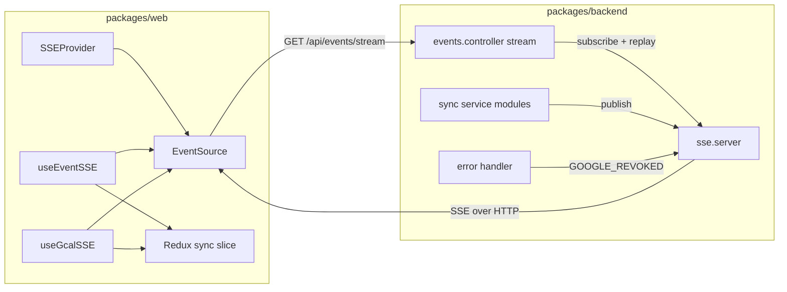
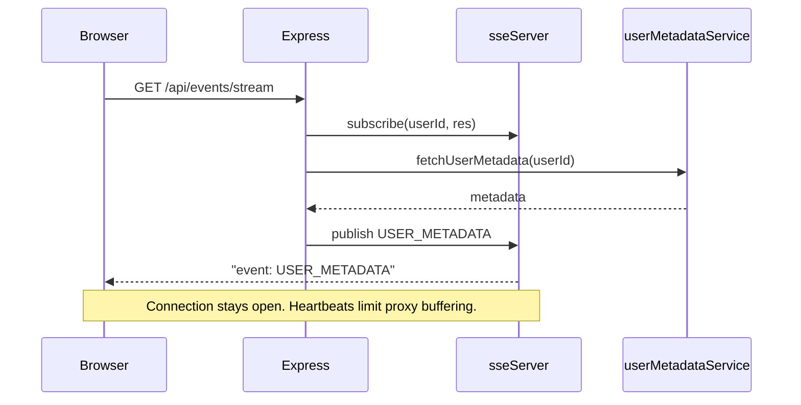

# Google Sync And Server-Sent Events (SSE)

Compass sync is bidirectional:

- Compass-originated event changes can propagate to Google and then notify web clients.
- Google-originated changes can flow back into Compass and then notify web clients.

Realtime updates use **Server-Sent Events** (one HTTP connection per tab, server pushes named events). The browser `EventSource` connects to `GET /api/events/stream` with the session cookie.

## High-Level Architecture



## Connection And First Events



## Shared Event Names

Source:

- `packages/core/src/constants/sse.constants.ts`

Wire format uses the `event:` field (uppercase identifiers). Backend and web both import these constants.

| Constant                | Role                                              |
| ----------------------- | ------------------------------------------------- |
| `EVENT_CHANGED`         | Calendar grid data should be refetched            |
| `SOMEDAY_EVENT_CHANGED` | Someday sidebar data should be refetched          |
| `USER_METADATA`         | Replay / push SuperTokens + sync metadata         |
| `IMPORT_GCAL_START`     | Full or repair import started                     |
| `IMPORT_GCAL_END`       | Import finished (see payload contract below)      |
| `GOOGLE_REVOKED`        | Google refresh token invalid; client prunes state |

### `IMPORT_GCAL_END` Payload Contract

Source:

- `packages/core/src/types/sse.types.ts`
- `packages/backend/src/user/services/user.service.ts`
- `packages/backend/src/sync/services/import/sync.import-runner.ts`
- `packages/backend/src/sync/services/repair/sync.repair-runner.ts`

`IMPORT_GCAL_END` carries an explicit `operation` so the client can distinguish repair completion from incremental completion.

```ts
type ImportGCalOperation = "INCREMENTAL" | "REPAIR";

type ImportGCalEndPayload =
  | {
      operation: ImportGCalOperation;
      status: "COMPLETED";
      eventsCount?: number;
      calendarsCount?: number;
    }
  | {
      operation: ImportGCalOperation;
      status: "ERRORED" | "IGNORED";
      message: string;
    };
```

Operational constraints:

- repair path (`syncRepairRunner.restartGoogleCalendarSync`) emits `operation: "REPAIR"`
- incremental path (`syncImportRunner.importIncremental`) emits `operation: "INCREMENTAL"`
- web listeners should keep a defensive `payload?` handler for compatibility with older emitters/tests

## Outbound Flow: User Changes An Event In Compass

High-level path:

1. UI dispatches an event action.
2. A saga performs optimistic updates.
3. The selected repository writes locally or remotely.
4. Remote event writes hit backend event routes.
5. `EventController` packages the change as a `CompassEvent`.
6. `CompassSyncProcessor.processEvents()` loads the DB event, plans work, applies persistence, and runs Google side effects.
7. After commit, the backend calls `sseServer` to publish notifications based on whether the change affected normal or someday events (`EVENT_CHANGED` vs `SOMEDAY_EVENT_CHANGED`).

Primary files:

- `packages/web/src/ducks/events/sagas/event.sagas.ts`
- `packages/web/src/common/repositories/event`
- `packages/backend/src/event/controllers/event.controller.ts`
- `packages/backend/src/sync/services/sync/compass/compass.sync.processor.ts`
- `packages/backend/src/sync/services/outbound/sync.compass-to-google.ts`

## Inbound Flow: Google Notifies Compass About Changes

High-level path:

1. Google posts to the notification endpoint in sync routes.
2. Backend verifies the request origin.
3. `syncNotificationService.handleGcalNotification()` locates the watch and sync record.
4. The service builds a Google Calendar client for the user.
5. `GCalNotificationHandler` fetches incremental changes using the stored sync token.
6. `GcalSyncProcessor` applies those changes to Compass data.
7. The backend publishes `EVENT_CHANGED` (or someday equivalent) so clients refetch.

Primary files:

- `packages/backend/src/sync/sync.routes.config.ts`
- `packages/backend/src/sync/controllers/sync.controller.ts`
- `packages/backend/src/sync/services/notify/sync.notification.service.ts`
- `packages/backend/src/sync/services/notify/handler/gcal.notification.handler.ts`
- `packages/backend/src/sync/services/sync/google/gcal.sync.processor.ts`
- `packages/backend/src/sync/services/import/sync.import-runner.ts`
- `packages/backend/src/sync/services/repair/sync.repair-runner.ts`
- `packages/backend/src/sync/services/watch/sync.watch.service.ts`

### Notification Outcomes And Error Semantics

Recoverable notification paths return `INITIALIZED`, `IGNORED`, or `PROCESSED`. Missing sync tokens and Google full-sync-required responses trigger a forced import restart. Missing or invalid Google refresh tokens prune Google data and publish `GOOGLE_REVOKED`.

## SSE Server Responsibilities

Source:

- `packages/backend/src/servers/sse/sse.server.ts`
- `packages/backend/src/events/controllers/events.controller.ts`

The SSE layer:

- accepts authenticated `GET /api/events/stream` requests (SuperTokens session)
- registers each open `Response` per user for fan-out
- sends periodic comment heartbeats (`: keepalive`) so buffering proxies do not delay events
- on connect, replays `USER_METADATA` after subscribe so reconnects get current state
- exposes helpers (`handleBackgroundCalendarChange`, `handleImportGCalEnd`, …) used by sync and error handling

## Web Client Responsibilities

Files:

- `packages/web/src/sse/client/sse.client.ts`
- `packages/web/src/sse/hooks/useSSEConnection.ts`
- `packages/web/src/sse/hooks/useEventSSE.ts`
- `packages/web/src/sse/hooks/useGcalSSE.ts`
- `packages/web/src/sse/provider/SSEProvider.tsx`

The client:

- opens `EventSource` when a session exists (`SessionProvider` + `SSEProvider`)
- refetches events when `EVENT_CHANGED` / `SOMEDAY_EVENT_CHANGED` arrive (via `Sync_AsyncStateContextReason` aligned with those names)
- tracks Google import status from `IMPORT_GCAL_*` and `USER_METADATA`
- handles `GOOGLE_REVOKED` consistently with REST error payloads

Redux reasons for refetch (`Sync_AsyncStateContextReason`) reuse the same string values as SSE event names where they correspond (`EVENT_CHANGED`, `SOMEDAY_EVENT_CHANGED`, `GOOGLE_REVOKED`), plus app-local reasons such as `IMPORT_COMPLETE`.

## Revoked Token And Reconnect Lifecycle

1. Backend detects missing/invalid Google refresh token (middleware, sync, or Google API error handling).
2. Backend prunes Google-origin data and publishes `GOOGLE_REVOKED` over SSE.
3. Web app marks Google as revoked in session memory and temporarily switches to local repository behavior.
4. User initiates re-consent via OAuth flow.
5. Backend auth handler determines mode server-side; reconnect updates credentials and metadata.

## User Metadata Shape Used By SSE And UI

`UserMetadata` includes Google connection state alongside sync state. It is pushed on stream connect (`USER_METADATA`) and available from `GET /api/user/metadata`.

### Google Metadata Status Semantics

Source files:

- `packages/backend/src/user/services/user-metadata.service.ts`
- `packages/core/src/types/user.types.ts`
- `packages/web/src/sse/hooks/useGcalSSE.ts`

Auto-import guardrail:

- client auto-starts import only when `sync.importGCal === "RESTART"` **and** `google.connectionState` is not `NOT_CONNECTED` or `RECONNECT_REQUIRED`

## Import Flow

1. Backend starts import.
2. SSE publishes `IMPORT_GCAL_START`.
3. Client reacts to metadata / `USER_METADATA` / `IMPORT_GCAL_END`.
4. Backend completes import and publishes `IMPORT_GCAL_END`.
5. Client stores import results and triggers a refetch when appropriate.

Primary backend files:

- `packages/backend/src/sync/services/import/sync.import-runner.ts`
- `packages/backend/src/sync/services/import/sync.import.ts`
- `packages/backend/src/sync/services/repair/sync.repair-runner.ts`
- `packages/backend/src/sync/services/watch/sync.watch.service.ts`
- `packages/backend/src/sync/services/outbound/sync.compass-to-google.ts`

The import runner owns full import, incremental import, and Google watch startup after import. The repair runner owns repair/restart orchestration and calls the import runner plus Compass-to-Google backfill.

## Maintenance Flow

Google watches are maintained separately from import and notification handling:

1. `/api/sync/maintain-all` calls `syncMaintenanceRunner.runMaintenance()`.
2. Maintenance classifies each user's watches as active, expiring soon, expired, or inactive.
3. Expired or inactive watches are pruned.
4. Expiring watches are refreshed.
5. If Google reports that a full sync is required during refresh, the user is force-restarted through the import runner.

Primary backend files:

- `packages/backend/src/sync/services/maintain/sync.maintenance-runner.ts`
- `packages/backend/src/sync/services/maintain/sync.maintenance.ts`
- `packages/backend/src/sync/services/watch/sync.watch.service.ts`

### Manual Import Trigger Contract

`POST /api/sync/import-gcal` returns `204` immediately; progress is asynchronous via SSE events (not polling).

## Debug

- Local debug dispatch of calendar-change notifications may use env `SSE_DEBUG_USER` (see `sync.debug.controller`).

## Rules Of Thumb For Changes

- New realtime behavior usually needs changes in `core` (`sse.constants` / `sse.types`), `backend` (`sse.server` + callers), and `web` (hooks listening via `EventSource`).
- If you add a new SSE event, update shared constants and both emit/listen sides.
- If the UI is stale after edits, confirm an SSE event is published and the sync slice handles it on the client.
