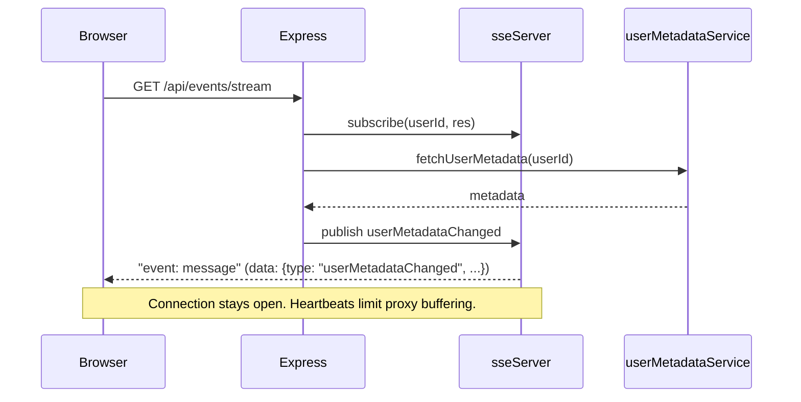

# Google Sync And Server-Sent Events (SSE)

Google Calendar sync is owned entirely by the standalone **Sync service**
(`packages/sync`) — the backend has no Google API calls or sync logic of its
own. The backend's role is: proxy sync-related reads/writes to Sync, poll
Sync's change feed, and translate what it learns into browser SSE.

Realtime updates use **Server-Sent Events** (one HTTP connection per tab).
The browser `EventSource` connects to `GET /api/events/stream` with the
session cookie.

## High-Level Architecture

```mermaid
flowchart LR
  subgraph Web["packages/web"]
    ES[EventSource]
    Prov[SSEProvider]
    Ev[useEventSSE]
    Gc[useGcalSSE]
    Store[userMetadata store]
  end
  subgraph Backend["packages/backend"]
    Stream[events.controller stream]
    Srv[sse.server]
    Bridge[sync-change-feed.bridge]
    Err[error handler]
  end
  subgraph Sync["packages/sync"]
    Feed[GET /internal/changes]
  end
  ES -->|GET /api/events/stream| Stream
  Stream -->|subscribe + replay| Srv
  Bridge -->|poll| Feed
  Bridge -->|publish| Srv
  Err -->|GOOGLE_REVOKED| Srv
  Srv -->|SSE over HTTP, one "message" event| ES
  Prov --> ES
  Ev --> ES
  Gc --> ES
  Ev --> Store
  Gc --> Store
```

## Connection And First Events

```mermaid
sequenceDiagram
  participant B as Browser
  participant X as Express
  participant S as sseServer
  participant M as userMetadataService
  B->>X: GET /api/events/stream
  X->>S: subscribe(userId, res)
  X->>M: fetchUserMetadata(userId)
  M-->>X: metadata
  X->>S: publish userMetadataChanged
  S-->>B: "event: message" (data: {type: "userMetadataChanged", ...})
  Note over B,S: Connection stays open. Heartbeats limit proxy buffering.
```

## Wire Format And Message Types

Source:

- `packages/core/src/constants/sse.constants.ts` — the SSE transport
- `packages/core/src/types/server-message.contracts.ts` — the message union

The server publishes **one** SSE event name, `message` (`SSE_MESSAGE_EVENT`).
Its `data` is a JSON-serialized `ServerMessage` union member; clients parse
once and switch on `type`. There is no longer a distinct SSE event name per
signal (`EVENT_CHANGED`, `IMPORT_GCAL_START`, etc. are retired).

| `type`                | Role                                              |
| ---------------------- | ------------------------------------------------- |
| `eventsChanged`         | Calendar grid data should be refetched            |
| `calendarsChanged`      | Calendar list should be refetched                 |
| `syncStatusChanged`     | Google connection health changed (syncing/healthy/attention) |
| `importCompleted`       | A full/incremental/repair import finished          |
| `userMetadataChanged`   | Replay / push SuperTokens + sync metadata         |

`SSEServer` (`packages/backend/src/servers/sse/sse.server.ts`) exposes one
named `publish*` convenience method per message type, plus a generic
`publish()`. A completeness test
(`packages/backend/src/servers/sse/sse.server.test.ts`) enforces that every
`publish*` method emits a schema-valid frame — keep it exhaustive when the
`ServerMessage` union grows.

## Outbound Flow: User Changes An Event In Compass

1. UI calls a mutation from `useEventMutations`.
2. The mutation's `onMutate` applies an optimistic update to the TanStack Query cache.
3. The mutation's `mutationFn` writes through the selected repository.
4. Remote event writes hit backend event routes, which submit a command to
   the Sync service (see [Backend](../backend/README.md#event-writes)).
5. The backend does not publish `eventsChanged` for its own write — the
   client already applied the change optimistically. Confirmation and
   cross-tab/cross-device fan-out come from the change-feed poll below.

Primary files:

- `packages/web/src/events/mutations/useEventMutations.ts`
- `packages/web/src/events/repositories`
- `packages/backend/src/event/controllers/event.controller.ts`
- `packages/backend/src/common/services/sync-service/` (Sync client)

## Inbound Flow: Sync Notifies The Backend About Changes

Google's own webhook ingress, OAuth flow, and import/repair logic all live
inside `packages/sync` and never touch the backend directly. The backend
learns about changes by polling Sync's own change feed:

1. While a user has at least one open SSE connection,
   `SyncChangeFeedBridge` (`packages/backend/src/servers/sse/sync-change-feed.bridge.ts`)
   polls `GET /internal/changes` on the Sync service every ~2s.
2. Each page of invalidations is translated to zero or more `ServerMessage`s
   by `syncInvalidationToServerMessages`
   (`packages/backend/src/servers/sse/sync-invalidation.to-server-message.ts`) —
   e.g. a Sync `event` invalidation becomes an `eventsChanged` message, an
   `importProgress` invalidation becomes `syncStatusChanged`/`importCompleted`.
3. The backend publishes each translated message over SSE.
4. Separately, `pruneGoogleDataAndNotifyRevoked`
   (`packages/backend/src/common/services/gcal/google-revoked.util.ts`)
   publishes `syncStatusChanged` with `code: "GOOGLE_REVOKED"` directly when
   the backend itself detects a revoked/missing Google grant.

Primary files:

- `packages/backend/src/servers/sse/sync-change-feed.bridge.ts`
- `packages/backend/src/servers/sse/sync-invalidation.to-server-message.ts`
- `packages/backend/src/common/services/gcal/google-revoked.util.ts`
- `packages/core/src/types/sync/change-feed.contracts.ts` (the Sync-side invalidation shapes)

## SSE Server Responsibilities

Source:

- `packages/backend/src/servers/sse/sse.server.ts`
- `packages/backend/src/events/controllers/events.controller.ts`

The SSE layer:

- accepts authenticated `GET /api/events/stream` requests (SuperTokens session)
- registers each open `Response` per user for fan-out
- sends periodic comment heartbeats (`: keepalive`) so buffering proxies do not delay events
- on connect, replays `userMetadataChanged` after subscribe so reconnects get current state

## Web Client Responsibilities

Files:

- `packages/web/src/sse/client/sse.client.ts`
- `packages/web/src/sse/hooks/useSSEConnection.ts`
- `packages/web/src/sse/hooks/useEventSSE.ts`
- `packages/web/src/sse/hooks/useGcalSSE.ts` (+ `useGcalSSE.factory.ts`)
- `packages/web/src/sse/hooks/useSyncFocusRefresh.ts`
- `packages/web/src/common/hooks/useVisibleAfterHidden.ts`
- `packages/web/src/sse/provider/SSEProvider.tsx`
- `packages/web/src/auth/google/hooks/useConnectGoogle/useConnectGoogle.ts`
- `packages/web/src/auth/google/state/google.sync.refresh.ts`

The client:

- opens `EventSource` when a session exists (`SessionProvider` + `SSEProvider`)
- refetches events when `eventsChanged` arrives (by invalidating the matching event query scopes)
- tracks Google sync/import status from `syncStatusChanged`/`importCompleted` and `userMetadataChanged`
- handles the `GOOGLE_REVOKED` `syncStatusChanged` code consistently with REST error payloads
- auto-refreshes Google Calendar sync on app focus (below)

Refetches are driven by TanStack Query invalidation keyed to the message
`type`; `userMetadataChanged` payloads land in the userMetadata Zustand
store.

### Focus Refresh

`SSEProvider` mounts `useSyncFocusRefresh`, which calls the same
`useConnectGoogle().refresh` path as the sidebar **Refresh calendar** button:

1. once when a refreshable connection becomes available on mount
2. again whenever the tab returns to visible after being hidden for at least
   30 seconds (`useVisibleAfterHidden`; same threshold as version checks)

Constraints:

- runs only for `HEALTHY` or `ATTENTION` connections (no-op while disconnected,
  reconnect-required, or still on the initial import)
- passes `silent: true` so a transient background failure does not toast the
  way a manual click's failure does
- shares the browser-wide refresh coordinator with manual clicks, so focus and
  CTA refreshes coalesce instead of racing

Without this, a user can stare at a stale “Updated …” label until they
remember to click **Refresh calendar**.

## Revoked Token And Reconnect Lifecycle

1. Backend detects missing/invalid Google refresh token (middleware or Google API error handling) or Sync reports it via the change feed.
2. Backend prunes Google-origin data and publishes a `syncStatusChanged` message with `code: "GOOGLE_REVOKED"`.
3. Web app marks Google as revoked in session memory.
4. User initiates re-consent via the OAuth flow (proxied to Sync).
5. Sync completes the OAuth exchange; the backend's next metadata fetch/change-feed poll picks up the reconnected state.

## Rules Of Thumb For Changes

- New realtime behavior usually needs changes in `core`
  (`server-message.contracts.ts`), `backend` (`sse.server` + whichever
  translator/caller publishes it), and `web` (hooks listening via
  `EventSource`).
- If you add a new `ServerMessage` member, add a matching `publish*` method
  on `SSEServer` and a case in `sse.server.test.ts`'s completeness table.
- If the UI is stale after edits, confirm a message is actually published
  (either via `sync-change-feed.bridge.ts`'s translation or a direct
  `sseServer.publish*` call) and that the web hook handles that `type`.
