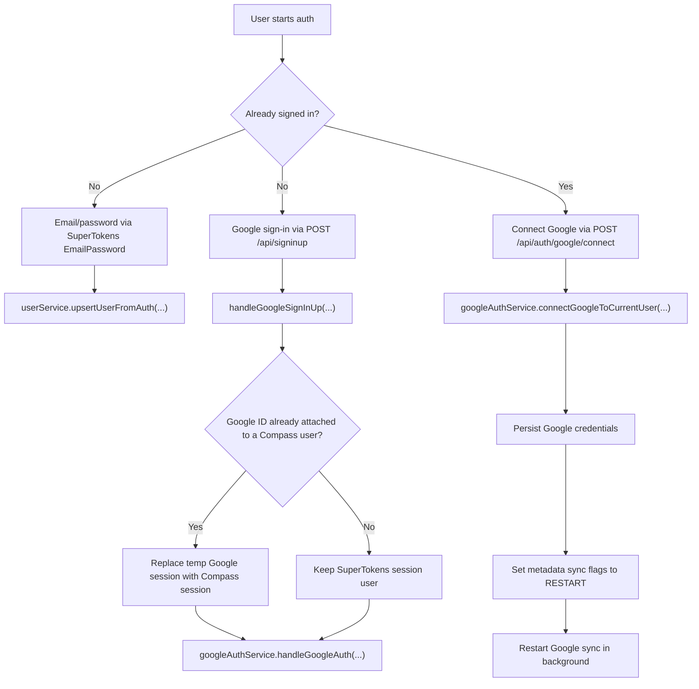

# Password Auth Flow

This document explains how the email/password auth flow works

## Scope

This flow adds first-party auth on top of the existing Google OAuth setup:

- sign up with email and password
- sign in with email and password
- forgot/reset password
- explicit Google connect/reconnect from an authenticated password session
- logged-out Google sign-in that reuses an existing Compass user when the
  Google account is already attached
- SuperTokens user-to-Compass-user mapping via Mongo `ObjectId` external ids

Primary files:

- `packages/web/src/components/AuthModal/AuthModal.tsx`
- `packages/web/src/components/AuthModal/hooks/useAuthFormHandlers.ts`
- `packages/web/src/auth/hooks/useCompleteAuthentication.ts`
- `packages/web/src/auth/session/SessionProvider.tsx`
- `packages/web/src/auth/state/auth.state.util.ts`
- `packages/backend/src/common/middleware/supertokens.middleware.ts`
- `packages/backend/src/common/middleware/supertokens.middleware.util.ts`
- `packages/backend/src/user/services/user.service.ts`
- `packages/backend/src/auth/services/google/google.auth.service.ts`

## Identity Model

Compass still treats the MongoDB `userId` as the canonical identity.

SuperTokens is configured so that:

- password sign-up ensures there is an external user id mapping, and that external id is a Mongo `ObjectId` string
- backend user upserts can canonicalize to an existing Compass user id by normalized email, then remap the auth session to that Compass id when needed
- Google sign-in/up resolves a canonical Compass user by `google.googleId` first, then by normalized email as fallback before creating a new id

Important constraints:

- Compass no longer relies on SuperTokens `AccountLinking` for the
  password-plus-Google flow.
- `google.googleId` remains the strongest ownership signal for Google-linked
  accounts.
- Email fallback only applies when no existing `google.googleId` owner is found.
- In-session Google connect still enforces both ownership and email-match
  checks; mismatch paths fail with `409` instead of reassigning ownership.

## Auth Flow Overview



Design intent:

- logged-out Google sign-in remains a SuperTokens third-party auth flow
- logged-in Google attach is an authenticated Compass backend flow
- logout is decoupled from Google state and succeeds even when no Google account
  is linked

## Web Entry Points

The password UI is surfaced in two ways:

- the account icon (`AccountIcon`) for unauthenticated users
- auth query params handled by `useAuthUrlParam()`

Supported URL entry points:

- `?auth=login`
- `?auth=signup`
- `?auth=forgot`
- `?auth=reset&token=...`

The temporary feature gate currently comes from `useAuthFeatureFlag()`:

- auth is enabled when `lastKnownEmail` exists in local auth state
- auth is also enabled when an `auth` query param is present

## Local Auth State

The web app stores a small auth state blob in localStorage:

```ts
{
  hasAuthenticated: boolean;
  lastKnownEmail?: string;
}
```

Responsibilities:

- preserve the fact that a user has authenticated before
- preserve the last known email for rollout gating after logout/session expiry
- migrate legacy `isGoogleAuthenticated` state into `hasAuthenticated`
- clear the in-memory Google-revoked fallback when auth succeeds again

Files:

- `packages/web/src/auth/state/auth.state.util.ts`
- `packages/web/src/common/constants/auth.constants.ts`

## Web Runtime Flow

### Session bootstrap

`SessionProvider.tsx` initializes SuperTokens with:

- `ThirdParty`
- `EmailPassword`
- `EmailVerification`
- `Session`

`EmailVerification` is currently initialized on the web client, but there is no
first-class `?auth=verify` modal flow in the auth UI.

At runtime it:

- checks whether a session already exists
- marks the user as authenticated in local auth state
- reconnects the websocket when a session exists
- refreshes user metadata after session creation/refresh

`UserProvider.tsx` also backfills `lastKnownEmail` from `/api/user/profile` once a previously-authenticated user is loaded.

### Shared post-auth completion

Both Google auth and password auth finish through `useCompleteAuthentication()`.

That hook:

1. marks the user as authenticated and stores the email when available
2. flips the session context to authenticated
3. dispatches Redux auth success/import-pending state
4. refreshes user metadata
5. syncs local IndexedDB events to the server
6. triggers a fresh event fetch
7. optionally closes the modal

This keeps Google sign-in and password sign-in aligned after the backend session is created.

## Modal And Form Flow

`AuthModal.tsx` owns view switching between:

- `login`
- `signUp`
- `forgotPassword`
- `resetPassword`

`useAuthFormHandlers.ts` owns the actual submits.

### Sign up

`handleSignUp()` calls `EmailPassword.signUp()` with:

- `name`
- `email`
- `password`

On success it calls `completeAuthentication()` with the resolved email and closes the modal.

### Log in

`handleLogin()` calls `EmailPassword.signIn()` with:

- `email`
- `password`

On success it also calls `completeAuthentication()`.

### Forgot password

`handleForgotPassword()` calls `EmailPassword.sendPasswordResetEmail()`.

The UI intentionally shows a generic success state so account existence is not leaked.

### Reset password

Reset starts from a link shaped like:

- `/day?auth=reset&token=...`

Important detail:

- `useAuthUrlParam()` removes `auth` from the URL after opening the modal
- `AuthModal` captures the first reset token it sees before that happens
- `handleResetPassword()` restores that token into the URL before calling `EmailPassword.submitNewPassword()`

That prevents the reset flow from breaking if the URL changes while the modal is open.

On success, the modal switches to `loginAfterReset`, which renders the login
form and a success status message:

- `"Password reset successful. Log in with your new password."`

## Backend Runtime Flow

`initSupertokens()` configures these recipes:

- `ThirdParty`
- `EmailPassword`
- `Dashboard`
- `Session`
- `UserMetadata`

Compass-owned Google connect happens through:

- `POST /api/auth/google/connect`
- `authController.connectGoogle(...)`
- `googleAuthService.connectGoogleToCurrentUser(...)`

### Google sign-in/up

Logged-out Google auth still enters through SuperTokens `signInUpPOST`, then:

1. `createGoogleSignInSuccess()` extracts the provider payload and session user id
2. `handleGoogleSignInUp()` checks whether `providerUser.sub` is already
   attached to an existing Compass user
3. if so, it replaces the temporary Google session with a Compass session for
   that existing user before continuing
4. `handleGoogleAuth()` decides between:
   - `SIGNUP`
   - `SIGNIN_INCREMENTAL`
   - `RECONNECT_REPAIR`
5. `googleAuthService` performs the matching backend path

The auth-mode decision is server-side and depends on:

- whether a Compass user already exists for the Google id
- whether a refresh token is stored
- whether sync health is good enough for incremental sync

### Google connect from an authenticated password session

When a logged-in password user chooses `Connect Google Calendar`:

1. the web client completes the Google popup flow
2. `useConnectGoogle()` sends the auth-code payload to
   `POST /api/auth/google/connect`
3. `connectGoogleToCurrentUser()` exchanges the code for Google tokens
4. backend verifies the Google account is not already owned by a different
   Compass user
5. backend persists Google credentials onto the current Compass user
6. backend marks metadata sync flags as `"RESTART"` and restarts sync in the
   background

This path does not call SuperTokens `signInUpPOST` and does not depend on
SuperTokens account linking.

### Google connect conflict contract

If a logged-in user attempts to connect a Google account that is already linked
to a different Compass user, backend connect intentionally fails with a conflict
instead of reassigning ownership.

Source path:

- `googleAuthService.connectGoogleToCurrentUser(...)`

Response contract:

- status: `409 CONFLICT`
- payload shape:

```json
{
  "result": "User not connected",
  "code": "GOOGLE_ACCOUNT_ALREADY_CONNECTED",
  "message": "Google account is already connected to another Compass user"
}
```

Email mismatch contract (same endpoint, when OAuth email does not match the
active Compass user email):

- status: `409 CONFLICT`
- payload shape:

```json
{
  "result": "User not connected",
  "code": "GOOGLE_CONNECT_EMAIL_MISMATCH",
  "message": "Google account email does not match the signed-in Compass account"
}
```

Operational implications:

- no Google credentials are persisted for the current session user on conflict
- metadata sync flags are not set to `"RESTART"` for that failed request
- clients should keep the current Compass session and prompt users to sign in
  with the account that already owns the Google connection

### Email/password sign-up and sign-in

The `EmailPassword` recipe is overridden in two places.

Function override:

- `createNewRecipeUser()` ensures an external user id mapping exists
- the mapping value is a new Mongo `ObjectId` string when one does not already exist

API overrides:

- `signUpPOST()` extracts `email` and `name` from form fields and calls `userService.upsertUserFromAuth()`
- `signInPOST()` extracts `email` and calls `userService.upsertUserFromAuth()`

This is the step that aligns the Compass user record with the canonical user
for that email and remaps the session when SuperTokens issued a different
temporary recipe user id.

### User upsert behavior

`userService.upsertUserFromAuth()`:

- validates the session user id as a Mongo `ObjectId`
- normalizes email casing and whitespace
- reuses an existing Compass user by normalized email before falling back to the
  requested session user id
- keeps an existing Google payload unless a new one is provided
- keeps the original `signedUpAt` on updates
- updates `lastLoggedInAt`
- creates default priorities only for a new Compass user

For repeated auth on the same user or same normalized email, this writes to the
existing Compass user instead of creating a duplicate record.

## Reset Password Delivery

Current behavior in `supertokens.middleware.ts`:

- all environments rewrite incoming SuperTokens password-reset links into Compass app URL shape
- `test` environment logs the rewritten reset link and skips provider delivery
- non-test environments pass the rewritten link to SuperTokens' original email sender (`originalImplementation.sendEmail`)
- if the incoming link has no `token` query param, backend keeps the original link unchanged

The rewritten reset link shape comes from `buildResetPasswordLink()`.

The host/origin portion is taken from backend env (`FRONTEND_URL`), and the
route is always `/day`.

- Reset: `http://[REDACTED]/day?auth=reset&token=...`

Email verification links are not currently rewritten into `?auth=verify` by backend middleware.

## Event And Sync Behavior After Password Auth

Password-only users can now mutate Compass events without a Google connection at the route layer.

Relevant changes:

- `event.routes.config.ts` no longer requires route-level Google connection middleware for create/update/delete
- `CompassSyncProcessor` applies the Compass mutation first
- if the Google side effect fails only because the user has no Google refresh token, the processor keeps the Compass mutation and skips the Google effect

That lets password-auth users use Compass without blocking on Google connectivity.

When a password-only user later connects Google:

- the existing Compass session is preserved
- Google credentials are attached to the current Compass user through
  `/api/auth/google/connect`
- metadata is updated to restart sync
- background Google sync is restarted as normal

This decouples Google attach from password auth and avoids the old
session-linking failure mode.

## Known Caveats

- The rollout gate is not limited to `lastKnownEmail`; any `?auth=` URL currently enables the auth UI.
- Reset password links always target the `/day` route and require a valid `FRONTEND_URL` in backend env.
- Logged-out same-email Google/password identities can now reuse the existing
  Compass user when no conflicting `google.googleId` owner exists.
- A Google account can belong to only one Compass user. In-session connect
  returns a conflict if the Google account is already attached elsewhere.
- Dated-route redirects preserve existing query params (including `auth=verify`), but `useAuthUrlParam()` only handles `login`, `signup`, `forgot`, and `reset`.
