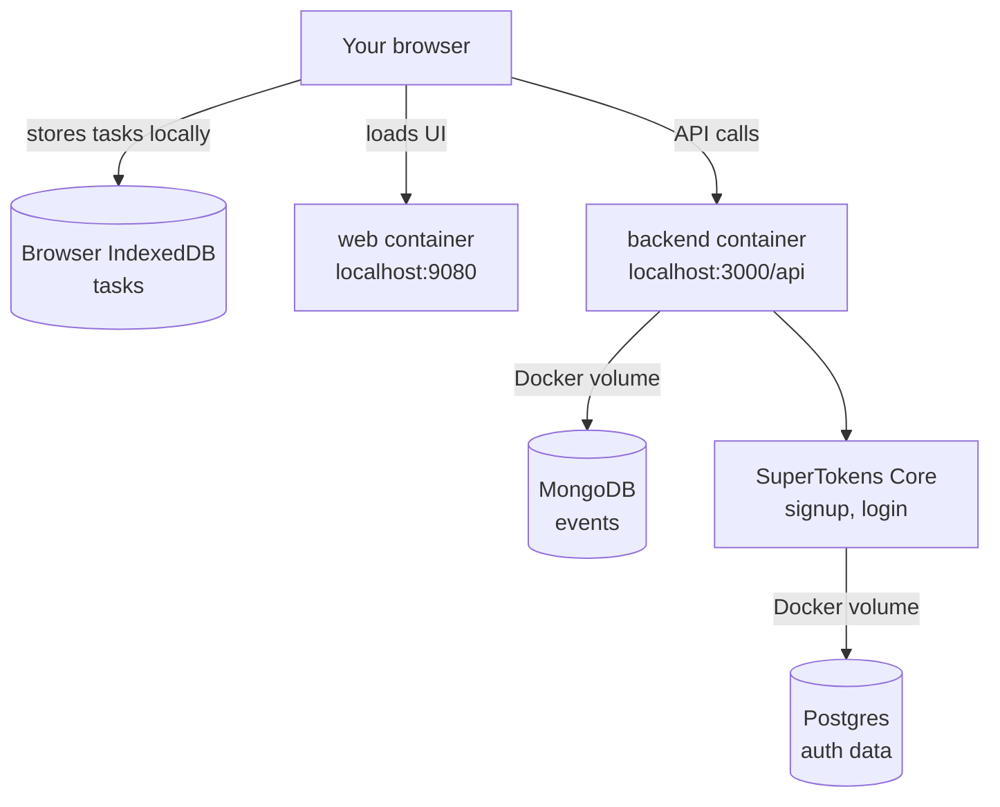

# Self-Hosting Compass

Self-hosting Compass means running it on a computer you control instead of using `compasscalendar.com`.

## What Compass is made of

When you run the installer, you get a stack of small services on your machine. Only the web app and backend API are reachable from your browser. The rest stay private inside Docker.

## Next steps

For the localhost guide, including what to expect, how to manage the install,
and troubleshooting, read [Local quickstart](./local-quickstart.md).

If you want Compass on a VPS with your own domain, read
[Server hosting guide](./server-guide.md).

## Other docs

| Guide | Use it when |
| --- | --- |
| [Backups and restore](./backups-and-restore.md) | You want to preserve or restore signed-in event data and auth data. |
| [Google Calendar](./google-calendar.md) | You want to understand no-Google mode, optional local Google OAuth/import, or public HTTPS Google watch notifications. |
| [Advanced manual setup](./advanced-manual.md) | You want to run the pieces yourself instead of using the installer. |

Have an idea on how we can make self-hosting easier? Let us know in [this GitHub Discussion](https://github.com/SwitchbackTech/compass/discussions/1694).
