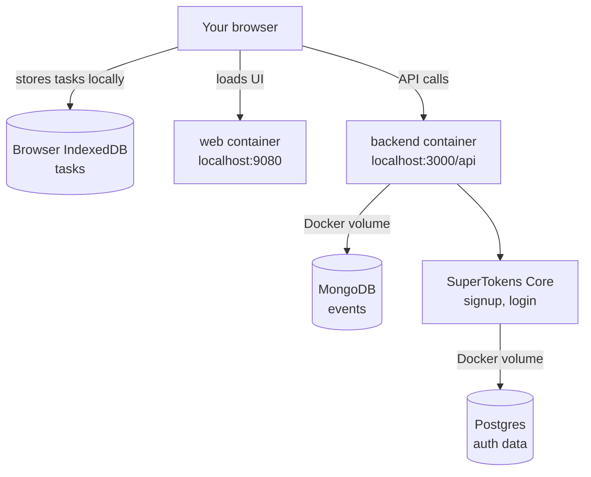

# Self-Hosting Compass

Self-hosting Compass means running it on a computer you control instead of using `app.compasscalendar.com`.

The supported path today is **local Docker self-hosting**: install on your Mac or Linux machine, open the web app at `http://localhost:9080`, sign up with email and password. Google Calendar is optional.

## What Compass is made of

When you run the installer, you get a stack of small services on your machine. Only the web app and backend API are reachable from your browser. The rest stay private inside Docker.

Two important things this picture doesn't show:

- **Your tasks live in your browser**, not in Mongo. They're stored in IndexedDB. Docker volume backups do not include them.
- **The installer creates a folder at `~/compass`** to hold your `.env` file, the helper script, and the app source. That folder is the only thing on your machine the installer touches outside Docker.

## Three flavors of self-hosting

Most people want the first one. Pick based on where you want Compass to live and whether you want Google Calendar.

- **On your laptop, no Google.** The default. Run the installer, open `localhost:9080`, sign up with email and password. This is the recommended path.
- **On your laptop, with Google sign-in or import.** Same install, plus your own Google OAuth client added to `~/compass/.env`. Continuous Google Calendar sync (Google pushing changes to Compass) needs a public HTTPS URL, so it isn't part of this path.
- **On a public server.** A VPS with Docker, your own domain, and Caddy in front for HTTPS. More setup, more responsibility. Use this when you want Compass reachable from anywhere or want to set up Google Calendar sync.

## Start here

For the localhost guide, including what to expect, how to manage the install,
and troubleshooting, read [Local quickstart](./local-quickstart.md).

If you want Compass on a VPS with your own domain, read
[Server hosting guide](./server-guide.md).

## Choose a guide

| Guide | Use it when |
| --- | --- |
| [Local quickstart](./local-quickstart.md) | You want the recommended local Docker install on your own Mac or Linux machine. |
| [Backups and restore](./backups-and-restore.md) | You want to preserve or restore signed-in event data and auth data. |
| [Google Calendar](./google-calendar.md) | You want to understand no-Google mode, optional local Google OAuth/import, or public HTTPS Google watch notifications. |
| [Server hosting guide](./server-guide.md) | You want to serve Compass from a public domain with Docker Compose and Caddy. |
| [Advanced manual setup](./advanced-manual.md) | You want to run the pieces yourself instead of using the installer. |

## Keep `.env` with your data

`~/compass/.env` holds the generated passwords and tokens that match your
Docker volumes. If the volumes stay but `.env` is gone, a new install creates
different credentials and can lock you out of the old data.

Before `./compass update` or anything that touches the install, back up
`~/compass/.env`, the Mongo volume, and the SuperTokens Postgres volume together.
They're a set. See [Backups and restore](./backups-and-restore.md).
Browser IndexedDB data (tasks, pre-signup events) is not included.

## What these guides do not set up yet

These docs keep the default path focused on local Docker self-hosting. They do not set up:

- a built-in HTTPS certificate or reverse proxy (the [server guide](./server-guide.md) covers this manually with Caddy)
- a built-in backup scheduler
- an automatic restore flow
- a rollback command for `./compass update`
- Docker backups for browser IndexedDB data
- continuous Google Calendar sync on the local-only install (see [Google Calendar](./google-calendar.md) for why)

Have an idea on how we can make self-hosting easier? Let us know in [this GitHub Discussion](https://github.com/SwitchbackTech/compass/discussions/1694).
