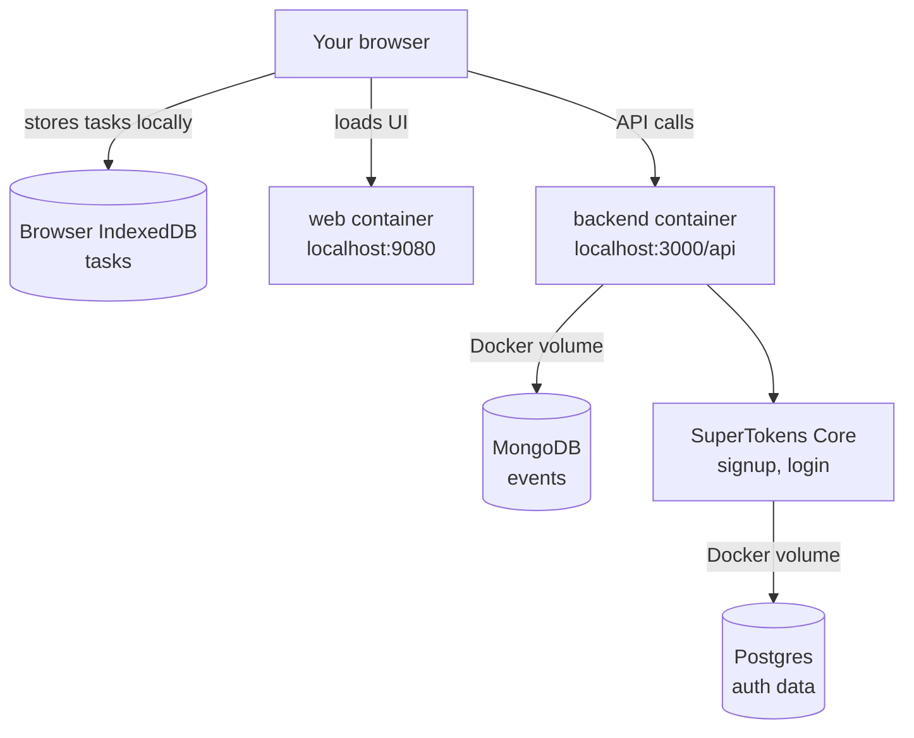

# Self-Hosting Compass

Self-hosting Compass means running it on a computer you control instead of using `app.compasscalendar.com`.

The supported path today is **local Docker self-hosting**: install on your Mac or Linux machine, open the web app at `http://localhost:9080`, sign up with email and password.

## What Compass is made of

When you run the installer, you get a stack of small services on your machine. Only the web app and backend API are reachable from your browser. The rest stay private inside Docker.

Important notes:

- **The installer creates a folder at `~/compass`** to hold your `.env` file, the helper script, and the app source. That folder is the only thing on your machine the installer touches outside Docker.

## Three flavors of self-hosting

Pick based on where you want Compass to live and whether you want Google Calendar.

- **On your laptop, no Google.** Run the installer, open `localhost:9080`, sign up with email and password.
- **On your laptop, with Google sign-in or import.** Same install, plus your own Google OAuth client added to `~/compass/.env`. Continuous Google Calendar sync (Google pushing changes to Compass) needs a public HTTPS URL, so it isn't part of this path.
- **On a public server.** A VPS with Docker, your own domain, and Caddy in front for HTTPS. More setup and responsibility. Use this when you want Compass reachable from anywhere or want full Google Calendar sync.

## Next steps

For the local guide, including what to expect, how to manage the install,
and troubleshooting, read [Local quickstart](./local-quickstart.md).

If you want Compass on a VPS with your own domain, read
[Server hosting guide](./server-guide.md).

## Other docs

| Guide | Use it when |
| --- | --- |
| [Backups and restore](./backups-and-restore.md) | You want to preserve or restore signed-in event data and auth data. |
| [Google Calendar](./google-calendar.md) | You want to understand no-Google mode, optional local Google OAuth/import, or public HTTPS Google watch notifications. |
| [Advanced manual setup](./advanced-manual.md) | You want to run the pieces yourself instead of using the installer. |
