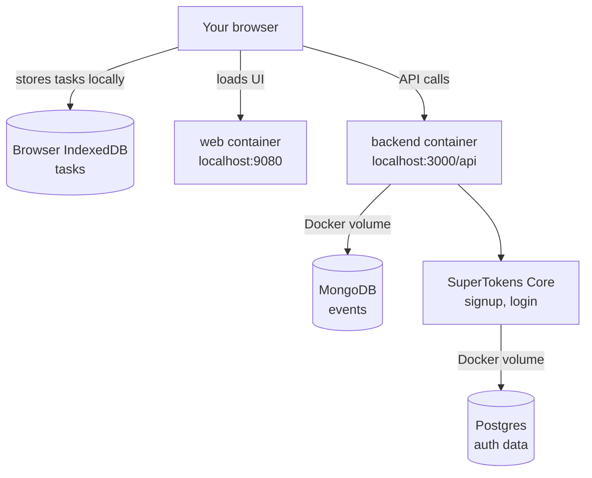

# Self-Hosting Compass

Self-hosting Compass means running it on a computer you control instead of using `app.compasscalendar.com`.

## What Compass is made of

When you run the installer, you get a stack of small services on your machine. Only the web app and backend API are reachable from your browser. The rest stay private inside Docker.

## Start here

For the localhost guide, including what to expect, how to manage the install,
and troubleshooting, read [Local quickstart](./local-quickstart.md).

If you want Compass on a VPS with your own domain, read
[Server hosting guide](./server-guide.md).

## What you still need to handle yourself

These docs keep the default path focused on local Docker self-hosting. They do not set up:

- a built-in HTTPS certificate or reverse proxy (the [server guide](./server-guide.md) covers this manually with Caddy)
- a built-in backup scheduler
- an automatic restore flow
- a rollback command for `./compass update`
- Docker backups for browser IndexedDB data
- continuous Google Calendar sync on the local-only install (see [Google Calendar](./google-calendar.md) for why)

Have an idea on how we can make self-hosting easier? Let us know in [this GitHub Discussion](https://github.com/SwitchbackTech/compass/discussions/1694).
