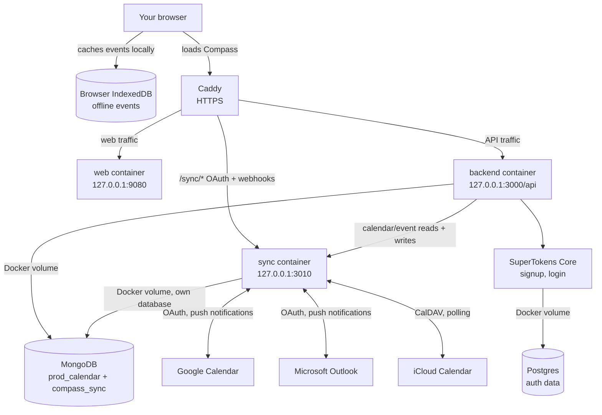

# Self-Hosting

You can run Compass on infrastructure you control instead of using the hosted version on `compasscalendar.com`

Start with [Run Compass on a server](./server-guide.md). It walks through a small VPS setup with your own domain, HTTPS, and the Compass services running behind a reverse proxy.

If you only want to run Compass on your own computer, use the normal local development flow with Bun instead of the self-host installer.

Self-host does not require Stripe. Omit the `stripe:` block so billing stays off and every account remains writable. Hosted Compass uses a 7-day trial then a paid subscription; see [Billing And Trial](../features/billing.md).

Optional calendar hosts: [Google Calendar](./google-calendar.md), [Microsoft Calendar](./microsoft-calendar.md), [iCloud Calendar](./apple-calendar.md).

## Compass architecture

When you self-host Compass on a server, you get a stack of small services. Only the public website and API are reachable from your browser. The databases stay private inside Docker.

```mermaid
flowchart TD
    browser[Your browser]
    indexeddb[(Browser IndexedDB<br/>offline events)]
    caddy[Caddy<br/>HTTPS]
    web[web container<br/>127.0.0.1:9080]
    backend[backend container<br/>127.0.0.1:3000/api]
    sync[sync container<br/>127.0.0.1:3010]
    mongo[(MongoDB<br/>prod_calendar + compass_sync)]
    supertokens[SuperTokens Core<br/>signup, login]
    postgres[(Postgres<br/>auth data)]
    google[Google Calendar]
    microsoft[Microsoft Outlook]
    apple[iCloud Calendar]

    browser -->|loads Compass| caddy
    caddy -->|web traffic| web
    caddy -->|API traffic| backend
    caddy -->|/sync/* OAuth + webhooks| sync
    browser -->|caches events locally| indexeddb
    backend -->|Docker volume| mongo
    backend -->|calendar/event reads + writes| sync
    backend --> supertokens
    sync -->|Docker volume, own database| mongo
    sync <-->|OAuth, push notifications| google
    sync <-->|OAuth, push notifications| microsoft
    sync <-->|CalDAV, polling| apple
    supertokens -->|Docker volume| postgres
```

Compass Sync owns calendar sync end to end (OAuth or app-specific password, webhooks or polling, and incremental pulls) in its own isolated database on the same bundled MongoDB. The backend never reads provider credentials directly. Sign-in with Google, Microsoft, or Apple stays a direct backend exchange, separate from calendar connect.

Google and Microsoft use push notifications for near-real-time updates. Apple has no push channel, so Sync polls iCloud on a dedicated reconcile sweep (see [Calendar providers](../features/calendar-providers.md#apple-polling-cadence)).

## Start here

Ready to get this setup on your infrastructure? See [Run Compass on a server](./server-guide.md)

----

Have an idea on how we can make self-hosting easier? Let us know in [this GitHub Discussion](https://github.com/SwitchbackTech/compass/discussions/1694).
